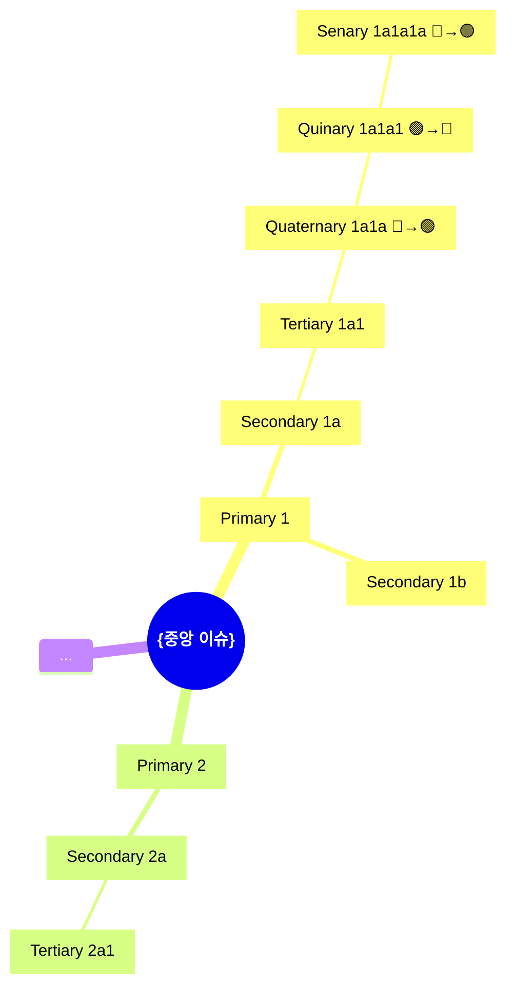

# Sub-skill: Basic Futures Wheel V1

> **출처**: Glenn J.C. (2009 [1971]). Futures Wheel. In J.C. Glenn & T.J. Gordon (Eds.), Futures Research Methodology V3.0, Chapter 06, §III.A + Figures 1·2·3
> **Wagschal rule 출처**: Wagschal P. (cited in Glenn 2009 §III.A, "rule of unanimity")
> **상위 마스터**: `vision-foresight-futures-wheel`
> **호출 권한**: 마스터 orchestration 전용. 사용자 직접 호출 금지(disable-model-invocation: true).

## 1. PDF 원전 정의

Glenn(2009) §III.A 핵심 verbatim:

> *"A group decides to brainstorm about a trend, idea, future event, or value. The subject is written in the middle of a piece of paper, a flip chart, blackboard, on a computer with video projector, or in software."*

> *"The leader of the brainstorming session draws an oval around the item and asks the group to say what necessarily goes with this item. As impacts or consequences are offered by the group, the leader draws short wheel-like spokes out from the central oval and writes these impacts at the end of each spoke."*

> *"Ovals are drawn around each of the primary impacts. A ring can be drawn connecting the primary impacts. Next, the leader asks the group to forget about the original item in the middle of the Futures Wheel and to give the most likely impacts for each of the primary impacts of the first ring of primary consequences. As these secondary impacts are offered by the group, the leader draws two or three short spokes out from each of the ovals around the primary impacts to form a second ring..."*

---

## 2. 결정론 환원 원칙

아래 연산은 **반드시 `wheel_engine.py`를 호출해 수행**한다. LLM이 재계산하면 할루시네이션 위험이 차단되지 않는다.

| 연산 | 방법 | 명령 |
|---|---|---|
| 입력 검증 (depth, count 범위 등) | wheel_engine.py | `validate` |
| Gate WebSearch 최소 횟수 계산 | wheel_engine.py | `websearch_count` |
| 부호 역전 ≥50% 검사 (Phase 6·7·8) | wheel_engine.py | `check_sign_reversal` |
| SRS (Sewongjima Reversal Score) | wheel_engine.py | `compute_srs` |
| Ring count 검증 | wheel_engine.py | `validate_ring_counts` |
| Ring table (마크다운) 생성 | wheel_engine.py | `build_ring_table` |
| CoER 3-step 구조 검증 | wheel_engine.py | `check_coer` |
| Impact 내용 생성 (브레인스토밍) | LLM | |
| Backlash/paradigm/civilization analog 서술 | LLM | |
| Synthesizer 패턴 추출 | LLM | |
| Mermaid/ASCII 시각화 | LLM (templated) | |

**CLI 호출:**

```bash
echo '<JSON>' | python3 wheel_engine.py <command>
```

---

## 3. CoER — Chain of Evidence Reasoning 정의

모든 impact는 **CoER 3-step**을 의무 포함:

| 단계 | 명칭 | 내용 |
|---|---|---|
| R-1 | Base Fact | 검증 가능한 사실 + inline citation [저자, 연도, URL] 필수 |
| R-2 | Intermediate | R-1과 impact 사이의 논리적 연결 |
| H | Hypothesis/Leap | 해당 impact 명제 자체 |

**검증 (wheel_engine.py `check_coer`):**

```bash
echo '{"coer_entries":[{"id":"P1","label":"...","R1_text":"...","R1_citation":"...","R2_text":"...","H_text":"..."}]}' | python3 wheel_engine.py check_coer
```

출처 없는 R-1 = CoER FAIL → Gate BLOCK.

---

## 4. AI Agent 4인 구성

| Agent | 역할 | Glenn 원전 매핑 |
|-------|------|---------------|
| **Leader Agent** | "what necessarily goes with this item?" 질문, Phase 진행, oval/spoke 페이스 조절 | "the leader of the brainstorming session" |
| **Brainstorm Panel (5~10인)** | primary·secondary·tertiary·quaternary·quinary·senary impact 제시. `foresight-expert-pool` 도메인 맞춰 캐스팅 | "the group" |
| **Synthesizer Agent** | ring별 패턴 추출, contradiction 감지, feedback loop 감지 | 명시되지 않은 보조 layer |
| **Visualizer Agent** | Figures 1·2·3 스타일 Mermaid·ASCII | "wheel-like spokes... ovals" |

---

## 5. 9 Phase 처리 흐름

### Phase 1 — Center Definition (T+0)

**입력 검증 (wheel_engine.py `validate`):**

```bash
echo '{"center_issue":{...},"depth_target":6,...}' | python3 wheel_engine.py validate
```

Leader Agent가 중앙 이슈를 한 oval로 명시. 4요소 필수:

```
{
  what: "이슈 정의",
  when: "시점 (e.g., 2028~2030)",
  where: "지리적 범위",
  who: "1차 주체"
}
```

```
        ┌─────────────────┐
        │  {중앙 trend/   │
        │   event/idea}   │
        └─────────────────┘
```

PDF Example: *"Increasingly small and less expensive computer communication devices"* (Figure 2)

### Phase 2 — Primary Ring (직접 영향, T+1~5y)

**⛩️ Gate_P1_Pre 자동 호출** (deep-reasoning-engine, blocking):

```bash
echo '{"ring_num":1,"parent_count":1}' | python3 wheel_engine.py websearch_count
# → min_websearch: 3
```

- WebSearch ≥3 강제 (wheel_engine.py 결정)
- evidence 수집 + inline citation 강제
- CoER 검증 (wheel_engine.py check_coer)
- 통과 못하면 BLOCK (재시도 최대 3회)

통과 후 Leader: *"What necessarily goes with this item?"*

Brainstorm Panel이 **5~10개** primary impact 제시. 각각:
- oval로 감싸기 / 중앙과 single spoke로 연결
- CoER 3-step 의무 (R-1[citation] → R-2 → H)
- 부호 + / - 명시 (Phase 6 역전 계산 기준)

PDF Figure 2 Example (computer communication devices):
1. Stores selling such items
2. Increased speed and complexity of daily living
3. More people in communications
4. Increasing awareness of other new technologies
5. Increasing awareness of other cultures and ideas
6. More business transactions in less time

### Phase 3 — First Ring Closure

모든 primary 표시 후 ring으로 연결("A ring can be drawn connecting the primary impacts"). 시각적 첫 번째 동심원 완성.

**ring count 검증 (wheel_engine.py `validate_ring_counts`):**

```bash
echo '{"depth_target":1,"ring_1":[...],"center_id":"Center"}' | python3 wheel_engine.py validate_ring_counts
```

### Phase 4 — Secondary Ring (T+5~10y)

**⛩️ Gate_P2_Pre 자동 호출:**

```bash
echo '{"ring_num":2,"parent_count":<primary_count>}' | python3 wheel_engine.py websearch_count
# → min_websearch = max(3, primary_count)
```

**핵심 전환**: Leader가 *"forget about the original item in the middle"* 지시.

Brainstorm Panel이 각 primary에서 **2~3개** secondary 분기. CoER + citation 의무. 부호 명시.

PDF Figure 3 Example:
- "Stores selling such items" → "High-tech sales force training", "Future-oriented customers", "More technologically literate societies"
- "Increased speed and complexity" → "Information overload", "Life more complex"

### Phase 5 — Tertiary Ring (T+10~20y)

**⛩️ Gate_P3_Pre 자동 호출:**

```bash
echo '{"ring_num":3,"parent_count":<secondary_count>}' | python3 wheel_engine.py websearch_count
# → min_websearch = max(3, secondary_count)
```

- **historical emergent analog ≥1 강제** (LLM 제공, 출처 인용)
- 각 secondary에서 **1~2개** tertiary spoke + oval
- CoER + citation 의무. 부호 명시.

---

### ⭐ Phase 6 — Quaternary Ring (T+15~25y, 세옹지마 1차 반전)

**⛩️ Gate_P4_Pre 자동 호출 ⭐:**

```bash
echo '{"ring_num":4,"parent_count":1}' | python3 wheel_engine.py websearch_count
# → min_websearch: 3 (fixed)
```

- **backlash analog 강제** (LLM: 산업혁명→러다이트, 디지털화→디지털디톡스 등, 출처 인용)
- **🔄 SIGN REVERSAL ≥50% 강제 (wheel_engine.py):**

```bash
echo '{"impacts":[{"id":"Q1","sign":"-","parent_sign":"+","ring_num":4},...]}' | python3 wheel_engine.py check_sign_reversal
# → must show passed: true, fraction ≥50%
```

- 통과 못하면 Gate BLOCK (최대 3회 재시도)

각 tertiary의 *backlash·역방향 압력* 발굴. 세옹지마 효과 시작.

산출 형식:
```
T1 (🔴 위기) → Q1 (🟢 backlash 회복)
T2 (🔴 위기) → Q2 (🟢 적응)
T3 (🟢 기회) → Q3 (🟡 의도치 못한 부작용)
```

---

### ⭐ Phase 7 — Quinary Ring (T+20~30y, 세옹지마 2차 반전·패러다임 전환)

**⛩️ Gate_P5_Pre 자동 호출 ⭐:**

```bash
echo '{"ring_num":5,"parent_count":1}' | python3 wheel_engine.py websearch_count
# → min_websearch: 3 (fixed)
```

- **paradigm shift analog 강제** (LLM: 코페르니쿠스·다윈·프로이트·양자역학, 출처 인용)
- **🔄🔄 SIGN REVERSAL ≥50% 강제 (wheel_engine.py `check_sign_reversal`, ring_num=5)**
- 통과 못하면 Gate BLOCK

Quaternary backlash가 *세계관·언어·제도* 재구성하는 단계. 반전의 반전.

각 quinary에 재구성되는 세계관·제도·언어 명시.

---

### ⭐ Phase 8 — Senary Ring (T+25~50y, 세옹지마 3차 반전·문명 단위)

**⛩️ Gate_P6_Pre 자동 호출 ⭐:**

```bash
echo '{"ring_num":6,"parent_count":1}' | python3 wheel_engine.py websearch_count
# → min_websearch: 2 (fixed)
```

- **civilizational analog 강제** (LLM: 농업혁명·문자혁명·산업혁명·정보혁명, 출처 인용)
- **🔄🔄🔄 SIGN REVERSAL ≥50% 강제 (wheel_engine.py `check_sign_reversal`, ring_num=6)**
- **chaos attractor 후보 ≥1 명시**: 퀴나리 영역에서 미세 변화가 세나리 결과를 크게 바꾸는 bifurcation point를 식별 (butterfly effect)
- 통과 못하면 Gate BLOCK

각 senary에 civilizational analog citation + attractor amplification mechanism 명시.

---

### Phase 9 — Evaluation Pass + SRS 검증

**SRS 계산 (wheel_engine.py `compute_srs`):**

```bash
echo '{"lineages":[{"id":"L1","signs":["+","-","+","-","+","-","+"],"path_labels":["Center","P1","S1","T1","Q1","Qn1","Sn1"]},...]}' | python3 wheel_engine.py compute_srs
```

SRS 기준:
- avg_SRS ≥ 1.5 → **EXCELLENT** (풍부한 세옹지마 효과)
- avg_SRS 1.0~1.49 → **ACCEPTABLE**
- avg_SRS < 1.0 → **REVISIONS_REQUIRED** — Phase 6/7/8 재작업

SRS = 각 lineage(Center→P→S→T→Q→Qn→Sn)에서 연속 부호 역전 횟수의 평균.

이어 PDF 명시 2가지 평가 방식 중 선택:

**방식 A — Fast (PDF §III.A 인용)**:

> *"At first, this process goes quickly, with participants listing second, third, and fourth order consequences with little or no evaluation. After the group feels its thinking is represented on the wheel, they can evaluate and edit the wheel to be more 'realistic.'"*

**방식 B — Wagschal (PDF §III.A 인용)**:

> *"Alternatively, the impacts of an event or trend can be processed more slowly and deliberately by accepting criticism prior to entering anything on the wheel. In this approach, the group discusses the plausibility of every impact. If an impact is judged plausible by all, then it is entered; otherwise, not. Peter Wagschal refers to this as the 'rule of unanimity.'"*

방식 B 선택 시 마스터가 `vision-foresight-futures-wheel-quality-control` sub-skill 함께 호출.

---

## 6. Mind Mapping vs Futures Wheel 구분

Glenn(2009) §III.A 명시:

> *"Sometimes people may want to pursue sequential chains of impacts radiating out in a linear fashion from the initial trend or event. This variation is referred to as Mind Mapping. The Futures Wheel, in contrast, completes each ring in concentric circles."*

| 방식 | 진행 형태 | 차수 구분 | 차원 균형 |
|------|---------|---------|---------|
| **Futures Wheel** (default) | concentric rings | primary→secondary→...→senary | 도메인 폭 넓게 |
| **Mind Mapping** | linear chains | 시간 순서 따라 흐름 | 깊이 우선, 가지별 |

본 sub-skill은 **Futures Wheel** 방식 강제. Mind Mapping 명시 요청 시에만 linear chain 전환 — 마스터 알림.

---

## 7. 입력 검증 명세

**전체 검증 (wheel_engine.py `validate`):**

```bash
echo '{"center_issue":{"what":"...","when":"...","where":"...","who":"..."},"depth_target":6,...}' | python3 wheel_engine.py validate
```

| 필드 | 타입 | 범위/규칙 | 출처 |
|---|---|---|---|
| center_issue.what | string | 필수, non-empty | Glenn (2009) §III.A |
| center_issue.when | string | 필수 | Glenn (2009) |
| center_issue.where | string | 필수 | Glenn (2009) |
| center_issue.who | string | 필수 | Glenn (2009) |
| depth_target | int | [1, 6], default=6 | 박사님 2026-05-11 강화 |
| primary_count_target | int | [5, 10] | Glenn: "5~10 short spokes" |
| secondary_per_primary | int | [2, 3] | Glenn: "two or three short spokes" |
| tertiary_per_secondary | int | [1, 2] | 스킬 규약 |
| evaluation_mode | string | "fast" or "wagschal" | Glenn §III.A |

---

## 8. 출력 표준 형식

### 8.1 Mermaid Mindmap (전체 6차까지)



### 8.2 ASCII Wheel (6차 포함)

```
                         Sn1a1 ─ Qn1a1 ─ Q1a1
                                         /
                      T1a1 ─── S1a ─── P1 ─── (ring 1)
                     /                         \
[Center] ──────────                             S1b ─── T1b1 ─ Q1b1 ─ Qn1b1 ─ Sn1b1
                     \
                      T2a1 ─── S2a ─── P2 ─── S2b ─── T2b1 ...
```

### 8.3 차수별 표 (6차 전체, wheel_engine.py `build_ring_table` 생성)

```bash
echo '{"depth_target":6,"ring_1":[...],...}' | python3 wheel_engine.py build_ring_table
```

표 형식:

```markdown
| 차수 | # | Impact | 시간 | 부모 oval | 부호 |
|-----|---|--------|------|-----------|------|
| Primary | P1 | {impact} | T+1~5y | Center | + |
| Primary | P2 | {impact} | T+1~5y | Center | - |
| Secondary | S1a | {impact} | T+5~10y | P1 | + |
| Secondary | S1b | {impact} | T+5~10y | P1 | - |
| Tertiary | T1a1 | {impact} | T+10~20y | S1a | + |
| Quaternary | Q1a1a | {impact} | T+15~25y | T1a1 | - |
| Quinary | Qn1a1a1 | {impact} | T+20~30y | Q1a1a | + |
| Senary | Sn1a1a1a | {impact} | T+25~50y | Qn1a1a1 | - |
```

### 8.4 PDF 원전 인용 fragment

```markdown
> *Glenn (2009) V3.0 §III.A*: "{관련 인용문}"
```

---

## 9. 마스터 입력 인터페이스

```yaml
sub_skill: vision-foresight-futures-wheel-basic-v1
inputs:
  center_issue:
    what: "{이슈 정의}"
    when: "{시점}"
    where: "{지리적 범위}"
    who: "{1차 주체}"
  depth_target: 6          # default 6 (박사님 강화), range [1,6]
  domains_frame: "{free-form or user-specified}"
  evaluation_mode: "fast"  # "fast" | "wagschal"
  primary_count_target: 7  # [5, 10]
  secondary_per_primary: 2  # [2, 3]
  tertiary_per_secondary: 1 # [1, 2]
  expert_pool_cast: []      # names from foresight-expert-pool
  web_research_results: {}
outputs:
  - mermaid_mindmap         # 6차까지 포함
  - ascii_wheel             # 6차까지 포함
  - tier_table              # wheel_engine.py build_ring_table 결과
  - pdf_citations
  - phase_log
  - srs_report              # wheel_engine.py compute_srs 결과
  - sign_reversal_reports   # wheel_engine.py check_sign_reversal × 3 (ring 4,5,6)
  - coer_validation         # wheel_engine.py check_coer 결과
```

---

## 10. Strengths (Glenn §IV)

Glenn (2009) §IV:
- *Easy and enjoyable*: no equipment necessary
- *Quick group thinking activation*
- *Easy to transfer and adapt*
- *Diagnoses group's collective thinking about the future*

본 sub-skill은 Glenn 원전 V1 본질 보존. Weaknesses(단순 collective judgment, correlation/causation 혼동, intellectual spaghetti)는 `vision-foresight-futures-wheel-quality-control` sub-skill에서 별도 점검.

---

## 11. 오류 및 예외 처리

| 상황 | 처리 | 마스터 대응 |
|---|---|---|
| center_issue 4요소 누락 | wheel_engine.py validate → errors | 입력 수정 후 재시도 |
| depth_target 범위 오류 | wheel_engine.py validate → errors | 1~6 범위로 수정 |
| primary_count < 5 | wheel_engine.py validate_ring_counts → errors | Brainstorm Panel 재시도 |
| WebSearch count 미달 | Gate BLOCK, 최대 3회 재시도 후 에러 보고 | 마스터 판단으로 count 완화 허용 |
| CoER citation 누락 | wheel_engine.py check_coer → errors | 해당 impact CoER 재작성 |
| 부호 역전 < 50% (Phase 6~8) | wheel_engine.py check_sign_reversal → FAIL | Phase 재작업 (부호 재할당) |
| SRS < 1.0 | wheel_engine.py compute_srs → REVISIONS_REQUIRED | Phase 6~8 재작업 |
| evaluation_mode 오류 | wheel_engine.py validate → errors | "fast" 또는 "wagschal"로 수정 |

---

## 12. 호출 후 마스터로 반환

```yaml
sub_skill_output:
  status: completed
  ring_count:
    primary: N
    secondary: M
    tertiary: K
    quaternary: L
    quinary: J
    senary: I
  srs_report:             # wheel_engine.py compute_srs 결과
    avg_srs: float
    status: EXCELLENT | ACCEPTABLE | REVISIONS_REQUIRED
  sign_reversal_reports:  # rings 4,5,6 각각
    ring_4: {passed, fraction_pct}
    ring_5: {passed, fraction_pct}
    ring_6: {passed, fraction_pct}
  coer_validation:        # wheel_engine.py check_coer 결과
    valid: bool
    complete_entries: int
  contradictions_detected: [...]
  feedback_loops_suspected: [...]
  scenario_branches: [...]
  visualizations:
    mermaid: "..."
    ascii: "..."
    table: "..."          # wheel_engine.py build_ring_table 결과
  pdf_citations: [...]
  agent_log:
    leader: "..."
    panel: "..."
    synthesizer: "..."
    visualizer: "..."
```

---

## 13. references/

| 파일 | 용도 |
|------|------|
| `references/figure2_computer_devices.md` | PDF Figure 2 (Computer Communication Devices) primary ring 재현 |
| `references/figure3_secondary_ring.md` | PDF Figure 3 (primary+secondary 통합) 재현 |
| `references/mindmap_vs_wheel.md` | Mind Mapping vs Futures Wheel 비교 가이드 |

---

## 참고문헌

- Glenn J.C. (2009 [1971]). Futures Wheel. In J.C. Glenn & T.J. Gordon (Eds.), Futures Research Methodology V3.0, Chapter 06, §III.A, Figures 1·2·3.
- Wagschal P. (cited in Glenn 2009 §III.A): "the rule of unanimity" — 방식 B 평가에서 all-agree-before-entering.
- 박사님 2026-05-11 강화: 6차 default, SRS (Sewongjima Reversal Score), SIGN REVERSAL ≥50% 강제.
