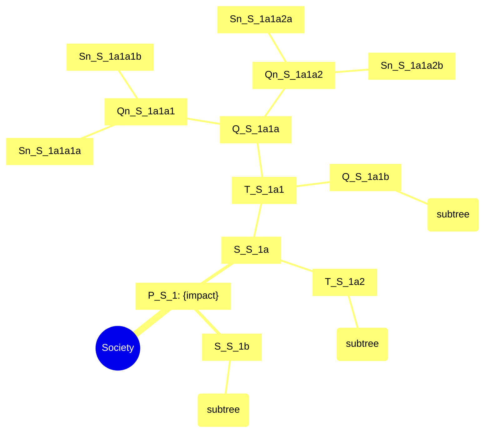

# Sub-skill: STEEPS Categorical Binary Expansion (SCBE)

> **출처**: 박사님 2026-05-11 두 번째 강화 명령 — *"AI 컴퓨팅 파워 활용 — 균일 2^n fan-out + STEEPS 카테고리 유지"*
> **상위 마스터**: `vision-foresight-futures-wheel`
> **호출 권한**: 마스터 Cycle 9 전용 (disable-model-invocation: true)
> **역할 분류**: generator (노드 생성기)

---

## 1. 본 sub-skill의 존재 이유

박사님 인용:
> *"퓨처스 휠의 가장 강력한 역할은 최초의 주제를 기점으로 2개 이상의 확장을 반복하는 것이다. 그래서 1차에서 2차로 넘어갈 때의 노드를 확장하는 것이 2의 n승이 된다. 인간은 이런 작업을 빠른 속도로 못한다. 이런 작업을 엄청난 속도로 할 수 있는 것이 컴퓨팅 파워이고, AI역량이다. 나는 이런 능력을 퓨처스 휠 스킬에 적극 수용하고 싶다."*

Glenn 원전 wheel은 *인간 group brainstorming 시뮬레이션* — 불균일 fan-out(5~10, 2~3, 1~2)이 인간 인지 한계의 흔적. 본 sub-skill은 **AI 컴퓨팅 파워**를 활용해 **균일 2^n fan-out + STEEPS 카테고리 propagation**을 강제. 컴퓨팅이 인간을 압도하는 *바로 그 영역*을 wheel에 적극 도입.

---

## 2. SCBE Protocol 정식 정의

### 2.1 균일 2-fan-out 강제

```yaml
SCBE_uniform_fanout:
  rule: "Senary leaf를 제외한 모든 노드는 정확히 2 children"
  
  default_branching: 2
  optional_branching: 3 (사용자 명시 시 — STEEPS 6 기준: 6×3^5=1458 senary, total 2185)
  # 검증: python3 scbe_validator.py validate_node_counts '{"n_primary":6,"fan_out":3}'
  
  enforcement:
    - "각 노드 children count == 2 강제"
    - "기존 basic-v1의 자유형 fan-out 사용 안 함"
    - "Glenn 원전 인간 brainstorming 시뮬레이션 → AI 컴퓨팅 모드로 전환"
```

### 2.2 STEEPS 카테고리 propagation — Anchored + Tagged 모델 (박사님 승인)

```yaml
node_schema:
  id: "P_S_1" | "S_S_1a" | "T_S_1a1" | ...
  
  primary_tag (필수, 항상 1개):
    options: [Society, Technology, Economy, Environment, Politics, Spirituality]
    inheritance: 부모 노드의 primary_tag 기본 계승
    exception: 사용자 명시 또는 cross-domain dominant 시 변경 가능 (단 1.5% 미만)
  
  secondary_tags (옵션, 0~3개):
    purpose: "cross-domain influence 표시"
    examples: 
      - primary_tag=Technology, secondary_tags=[Economy] 
        → 기술 영향이 경제 도메인으로 cross-influence
  
  category_balance_check:
    rule: "각 차수에서 카테고리별 노드 수 균등 (±0)"
    senary: STEEPS 6 → 카테고리당 32 노드, 총 192
```

### 2.3 노드 명명 규칙 (결정론 생성 — scbe_validator.py generate_id)

```
ID 구조: {차수prefix}_{STEEPS letter}_{lineage index}

차수prefix (ring prefix — 항상 왼쪽, 파싱 시 우선 적용):
  P  = Primary    (ring 1)
  S  = Secondary  (ring 2)
  T  = Tertiary   (ring 3)
  Q  = Quaternary (ring 4)
  Qn = Quinary    (ring 5)
  Sn = Senary     (ring 6)

STEEPS letter (카테고리 — 항상 중간):
  S   = Society
  T   = Technology
  E   = Economy
  Env = Environment
  P   = Politics
  Sp  = Spirituality

⚠️ ID 충돌 해소 규칙 (결정론 — 모호성 완전 제거):
  "P_P_1"  → ring_prefix=P(Primary), category=P(Politics): Primary Politics 1번
  "S_S_1a" → ring_prefix=S(Secondary), category=S(Society): Secondary Society 1a번
  "T_T_1a1"→ ring_prefix=T(Tertiary), category=T(Technology): Tertiary Technology 1a1번
  규칙: {ring_prefix}_{category_letter}_{lineage} 순서가 고정이므로 파싱 시
        첫 번째 분절이 ring prefix, 두 번째가 category letter (항상 우선 결정)
  검증: python3 scbe_validator.py parse_id '{"node_id": "P_P_1"}'

lineage index (결정론 패턴: 1[ab[12]]*[ab]?):
  1차: 1
  2차: 1a, 1b
  3차: 1a1, 1a2, 1b1, 1b2
  4차: 1a1a, 1a1b, 1a2a, 1a2b, 1b1a, 1b1b, 1b2a, 1b2b
  5차: 1a1a1, 1a1a2, ..., 1b2b2 (16개)
  6차: 1a1a1a, 1a1a1b, ..., 1b2b2b (32개)

  lineage depth = len(lineage): "1"→1, "1a"→2, "1a1"→3, "1a1a"→4, "1a1a1"→5, "1a1a1a"→6
  검증: python3 scbe_validator.py validate_lineage '{"lineage": "1a1a1a"}'

ID 생성 (결정론 — 직접 입력 금지, 반드시 Python 호출):
  python3 scbe_validator.py generate_id '{"ring": 6, "category": "Spirituality", "lineage_path": "1a1a1a"}'
  → {"node_id": "Sn_Sp_1a1a1a", ...}

예시 (참고만 — 실제 생성은 Python):
  P_S_1: Primary Society 1번
  S_S_1a, S_S_1b: P_S_1의 2 children (Secondary Society)
  T_S_1a1, T_S_1a2: S_S_1a의 2 children (Tertiary Society)
  ...
  Sn_S_1a1a1a, Sn_S_1a1a1b: Senary Society leaf nodes
```

### 2.4 STEEPS 카테고리 정의 (default 6)

```yaml
STEEPS_default:
  Society:
    scope: 인구구조·계급·가족·교육·세대·문화·라이프스타일·관계
  Technology:
    scope: 기술혁신·플랫폼·인프라·R&D·과학·디지털·AI·바이오
  Economy:
    scope: 산업·노동·자본·금융·통화·무역·소비·생산성
  Environment:
    scope: 기후·생태·자원·도시·재난·에너지·식량
  Politics:
    scope: 정부·국제관계·법·규제·지정학·정당·시민운동
  Spirituality:
    scope: 영성·세계관·가치관·의미·종교·철학·윤리·삶의 목적

V2_8_sector_option (Glenn 원전 default — 사용자 선택 시):
  추가: Cultural, Psychological, Educational, Public Welfare
  총 노드: 505 (Center 1 + 8 카테고리 × 63 = 504)
  (Glenn V2 + 박사님 영성 변형은 마스터 Implications Domain 옵션)
```

### 2.5 SRS 세옹지마 역전 판정 규칙 (결정론 — scbe_validator.py srs_reversal_rule)

세옹지마 역전은 **완전한 부호 반전**만 인정. 중립(🟡) 관련 모호성을 결정론으로 차단:

```
REVERSAL = True  iff:
  parent=🟢(+) AND child=🔴(-)   [긍정→부정 완전 반전]
  parent=🔴(-) AND child=🟢(+)   [부정→긍정 완전 반전]

REVERSAL = False if:
  parent=🟡(0) → any child       [중립 부모: 방향 없음, 역전 기산 불가]
  any parent   → child=🟡(0)     [중립 자식: 완전 반전 아님]
  same sign (++ or --)           [동방향: 역전 아님]

검증:
  python3 scbe_validator.py srs_reversal_rule '{"parent": "🟡", "child": "🔴"}'
  → {"reversal": false, "rule": "not reversal: neutral parent"}

  python3 scbe_validator.py srs_reversal_rule '{"parent": "🟢", "child": "🔴"}'
  → {"reversal": true, "rule": "reversal: + → - (positive→negative full flip)"}
```

**근거**: Pacinelli 세옹지마 원칙 — 실질적 의미 반전(塞翁之馬)은 분명한 방향 전환을 요구.
중립→음 또는 양→중립을 역전으로 카운트하면 비선형성 과장 → 보수적 기준 채택.

### 2.6 결정론 Python 호출 의무 (할루시네이션 구조적 차단)

아래 단계들은 **LLM이 자연어로 재추론 금지**. 반드시 Python 호출 결과를 그대로 사용:

```bash
# 스킬 폴더 위치
SCBE_DIR="<skill_folder>/vision-foresight-futures-wheel-categorical-binary-expansion"

# 1. 노드 수 계산 (시작 전 + 각 ring 완성 후)
python3 "$SCBE_DIR/scbe_validator.py" validate_node_counts '{"n_primary": 6}'

# 2. 카테고리 균형 감사 (각 ring 완성 후)
python3 "$SCBE_DIR/scbe_validator.py" balance_audit \
  '{"category_counts": {"Society": N, "Technology": N, ...}}'

# 3. Node ID 생성 (각 노드마다)
python3 "$SCBE_DIR/scbe_validator.py" generate_id \
  '{"ring": 4, "category": "Economy", "lineage_path": "1a1a"}'

# 4. Fan-out 검증 (의심 노드 발생 시)
python3 "$SCBE_DIR/scbe_validator.py" validate_fanout \
  '{"node_id": "Q_E_1a1a", "children": ["Qn_E_1a1a1", "Qn_E_1a1a2"]}'

# 5. SRS 역전 판정 (sign 부여 후)
python3 "$SCBE_DIR/scbe_validator.py" srs_reversal_rule \
  '{"parent": "🟡", "child": "🔴"}'

# 6. 카테고리 SRS 검증 (ring 4/5/6 완성 후)
python3 "$SCBE_DIR/scbe_validator.py" srs_category \
  '{"signs": ["🟢","🔴","🔴","🟢","🔴","🟢"], "category": "Technology"}'

# 7. PRRG 최소 검색 수 확인 (각 Gate 전)
python3 "$SCBE_DIR/scbe_validator.py" prrg_gate '{"ring": 1, "n_categories": 6}'

# 8. Cross-domain matrix (Phase 9 전)
python3 "$SCBE_DIR/scbe_validator.py" cross_domain_matrix '{"nodes": [...]}'

# 9. 최종 품질 게이트 (출력 전)
python3 "$SCBE_DIR/scbe_validator.py" final_quality_gate '{...}'

# 마스터 스킬 보조 함수 (ring 시간축, Cycle 분류 등)
python3 "../vision-foresight-futures-wheel/wheel_math.py" ring_time_axis '{"ring_number": 4}'
python3 "../vision-foresight-futures-wheel/wheel_math.py" mde_depth_check '{"depth_requested": 6}'
```

**위반 시**: 결과가 Python 출력과 다른 숫자·ID를 LLM이 자연어로 출력하면
마스터가 해당 노드/섹션을 자동 REJECT하고 재생성 요청.

---

## 3. AI Agent 5인 구성

| Agent | 역할 |
|-------|------|
| **Tree Generator** | 균일 2-fan-out 트리 노드 생성, 각 노드 impact text·sign·timing 산출 |
| **STEEPS Propagation Manager** | 카테고리 inheritance 관리, 균형 강제 (±0) |
| **Cross-Domain Tagger** | secondary_tags 부여, cross-domain influence 식별 |
| **Analog Batcher** | 같은 카테고리 노드들의 공통 historical analog 묶음 처리 |
| **3-Layer Display Formatter** | Layer 1·2·3 출력 양식화 |

---

## 4. 9 Phase 처리 흐름

### Phase 1 — Frame Selection

```yaml
frame:
  default: STEEPS 6 (Society·Technology·Economy·Environment·Politics·Spirituality)
  alternatives:
    - V2 8 sector (Glenn 원전 default, 256 senary 노드)
    - STEEP 5 (Spirituality 제외)
    - STEEPV 6 (Coates Values 포함)
    - Custom (사용자 정의)
  
  branching:
    default: 2 (2-fan-out, 192 senary)
    alternative: 3 (3-fan-out, STEEPS 6 기준 senary=1458·total=2185 — 박사님 명시 시만)
    # 결정론 검증: python3 scbe_validator.py validate_node_counts '{"n_primary":6,"fan_out":3}'
```

### Phase 2 — Center Definition

basic-v1과 동일. 마스터에서 4요소(무엇·언제·어디서·누구) 전달.

### Phase 3 — Primary Ring (per category 1)

각 STEEPS 카테고리에서 정확히 1개 primary impact 발굴:

⛩️ **Gate_P1_Pre 자동 호출** (deep-reasoning-engine):
```bash
# PRRG 최소 검색 수 결정론 확인 (LLM 재추론 금지)
python3 scbe_validator.py prrg_gate '{"ring": 1, "n_categories": 6}'
# → min_searches: 6 (STEEPS 6 × 1 query/category), extra_required: null
```
- WebSearch ≥6 (카테고리당 1 query, STEEPS 6 기준 = 6회)
- 각 카테고리별 evidence 수집 후 노드 생성

```bash
# 노드 수 검증 (ring 1 완성 후)
python3 scbe_validator.py validate_node_counts '{"n_primary": 6}'
python3 scbe_validator.py balance_audit '{"category_counts": {"Society": 1, "Technology": 1, "Economy": 1, "Environment": 1, "Politics": 1, "Spirituality": 1}}'
```

산출:
```yaml
P_S_1 (Primary Society):
  text: "..."
  primary_tag: Society
  secondary_tags: []
  sign: 🟢/🔴/🟡
  time: T+1~5y  # wheel_math.py ring_time_axis {"ring_number": 1} → "T+1~5y"
  reasoning_chain: { step_1[R-1], step_2[R-2], step_3[H] }
  citation: "[저자, 연도, URL]"

P_T_1 (Primary Technology): {...}
P_E_1 (Primary Economy): {...}
P_Env_1 (Primary Environment): {...}
P_P_1 (Primary Politics): {...}
P_Sp_1 (Primary Spirituality): {...}

총: 6 primary 노드 (STEEPS 6 기준) — Python balance_audit으로 확인
```

### Phase 4 — Secondary Ring (per category 2, 총 12)

각 primary에서 정확히 2 secondary 분기. 카테고리 inheritance:

```yaml
P_S_1 → S_S_1a, S_S_1b (둘 다 Society inherit)
P_T_1 → S_T_1a, S_T_1b
...

각 secondary는 *부모 primary의 카테고리* 기본 계승.
단 secondary_tags로 cross-domain influence 명시 가능.
```

⛩️ **Gate_P2_Pre 자동 호출**:
```bash
python3 scbe_validator.py prrg_gate '{"ring": 2, "n_categories": 6}'
# → min_searches: 6 (카테고리당 1)
```
WebSearch ≥6 (카테고리당 1).

```bash
# ring 2 완성 후 balance_audit
python3 scbe_validator.py balance_audit '{"category_counts": {"Society": 2, "Technology": 2, ...}}'
# → 각 카테고리 정확히 2 → pass: true
```

### Phase 5 — Tertiary Ring (per category 4, 총 24)

각 secondary에서 2 tertiary. 카테고리 inheritance 유지.

⛩️ **Gate_P3_Pre 자동 호출**:
```bash
python3 scbe_validator.py prrg_gate '{"ring": 3, "n_categories": 6}'
# → min_searches: 6, extra_required: "historical analog per category"
```
Historical analog **6건** (카테고리당 1 — `references/analog_catalog.md` `historical_emergent` 섹션).

```bash
# ring 3 완성 후 balance_audit
python3 scbe_validator.py balance_audit '{"category_counts": {"Society": 4, "Technology": 4, ...}}'
```

### ⭐ Phase 6 — Quaternary Ring (per category 8, 총 48)

각 tertiary에서 2 quaternary. **세옹지마 1차 반전 강제**.

**역전 기준**: 각 카테고리에서 8 quaternary 중 ≥4 (50%)가 직전 tertiary 부모와 반대 부호.
역전 판정: `scbe_validator.py srs_reversal_rule` 결과 기준 (중립 🟡 처리 포함).

⛩️ **Gate_P4_Pre 자동 호출**:
```bash
python3 scbe_validator.py prrg_gate '{"ring": 4, "n_categories": 6}'
# → min_searches: 3, extra_required: "backlash analog per category" (6건)
```
**Backlash analog batching** — `references/analog_catalog.md` `backlash` 섹션:
Society→러다이트, Technology→디지털디톡스, Economy→반세계화, Environment→귀농,
Politics→포퓰리즘 backlash, Spirituality→탈종교 backlash.

```bash
# SRS 강제 역전 검증 (ring 4 완성 후, 각 카테고리별)
python3 scbe_validator.py srs_category '{"signs": ["🟢","🔴","🔴","🟢","...","..."], "category": "Society"}'
# → forced_reversal_check["ring3→ring4"]: true 확인
```

### ⭐ Phase 7 — Quinary Ring (per category 16, 총 96)

각 quaternary에서 2 quinary. **세옹지마 2차 반전 강제** + **paradigm shift analog batching**.

⛩️ **Gate_P5_Pre 자동 호출**:
```bash
python3 scbe_validator.py prrg_gate '{"ring": 5, "n_categories": 6}'
# → min_searches: 3, extra_required: "paradigm shift analog per category"
```
Paradigm shift analog (`references/analog_catalog.md` `paradigm_shift` 섹션):
Society→다윈, Technology→코페르니쿠스, Economy→케인즈,
Environment→IPCC, Politics→민주화 물결, Spirituality→종교개혁.

```bash
# SRS ring4→ring5 강제 역전 검증
python3 scbe_validator.py srs_category '{"signs": [...], "category": "..."}'
# → forced_reversal_check["ring4→ring5"]: true 확인
```

### ⭐ Phase 8 — Senary Ring (per category 32, 총 192)

각 quinary에서 2 senary. **세옹지마 3차 반전 + 문명 단위 변환** + **civilizational analog**.

⛩️ **Gate_P6_Pre 자동 호출**:
```bash
python3 scbe_validator.py prrg_gate '{"ring": 6, "n_categories": 6}'
# → min_searches: 2, extra_required: "civilizational analog (모든 카테고리 공유)"
```
Civilizational analog (전 카테고리 공유 — `references/analog_catalog.md` 하단 공유 섹션):
농업혁명·문자혁명·산업혁명·정보혁명 + chaos attractor 표시.

```bash
# SRS ring5→ring6 강제 역전 + 최종 balance 검증
python3 scbe_validator.py srs_category '{"signs": [...], "category": "..."}'
python3 scbe_validator.py balance_audit '{"category_counts": {"Society": 63, ...}}'
```

### Phase 9 — 3LDP Output Generation

3-Layer Display Protocol에 따라 가독성 보장:

#### Layer 1 — Executive Summary (~1 page)

```markdown
## STEEPS Categorical Senary Synthesis

### Society 6차 narrative (32 nodes 핵심 패턴)
{Society 카테고리의 6차 32 노드 중 핵심 narrative 1 문단}

### Technology 6차 narrative
{...}

... (모든 카테고리)

### 세옹지마 Reversal Trace (6 라인)
Society:      P🟢 → S🔴 → T🔴 → Q🟢 → Qn🟢 → Sn🟡
Technology:   P🟢 → S🟢 → T🔴 → Q🟢 → Qn🔴 → Sn🟢
Economy:      P🔴 → S🔴 → T🟢 → Q🟡 → Qn🟢 → Sn🟢
Environment:  P🔴 → S🔴 → T🟡 → Q🟢 → Qn🟢 → Sn🟡
Politics:     P🔴 → S🟡 → T🔴 → Q🟢 → Qn🔴 → Sn🟢
Spirituality: P🟡 → S🟢 → T🟢 → Q🔴 → Qn🟢 → Sn🟢
```

#### Layer 2 — Categorical Tree (6 collapsible)

```markdown
<details>
<summary><b>▶ Society Tree (1+2+4+8+16+32 = 63 nodes)</b></summary>


</details>

<details>
<summary><b>▶ Technology Tree (63 nodes)</b></summary>
{...}
</details>

(이하 모든 카테고리)
```

#### Layer 3 — Full Node Catalog (별도 markdown 파일 또는 부록)

```markdown
## Full Node Catalog

### Society Category (63 nodes)

#### Primary
##### P_S_1
- **Impact**: {text}
- **Sign**: 🟢
- **Time**: T+1~5y
- **Tags**: primary=Society, secondary=[]
- **Reasoning Chain**:
  - Step 1 (R-1): {base fact} — [citation]
  - Step 2 (R-2): {intermediate} — [citation]
  - Step 3 (H): {leap} — Disclosed assumption: {...}

#### Secondary
##### S_S_1a
{...}
##### S_S_1b
{...}

... (모든 63 노드)

### Technology Category (63 nodes)
{...}

(이하 모든 카테고리, 총 379 노드 = Center 1 + 카테고리당 63 × 6)
```

---

## 5. Evidence Batching 전략 (토큰 효율)

```yaml
analog_catalog (사전 준비, 박사님 단행본 본업 영역에서 자주 등장):
  
  Society:
    historical_emergent (3차용): "산업혁명→도시화→노동운동"
    backlash (4차용): "산업혁명→러다이트 운동(1811)"
    paradigm_shift (5차용): "다윈→인간=특별창조 신화 해체"
    civilizational (6차용): "농업혁명→정착·국가"
  
  Technology:
    historical_emergent: "PC→인터넷→소셜미디어"
    backlash: "디지털화→디지털디톡스(2015~)"
    paradigm_shift: "코페르니쿠스→지구중심 세계관 붕괴"
    civilizational: "문자혁명→기록·법·도시"
  
  Economy:
    historical_emergent: "글로벌화→가치사슬·소비주의"
    backlash: "글로벌화→반세계화·보호무역(2016~)"
    paradigm_shift: "케인즈→재정·통화 정책 패러다임"
    civilizational: "화폐혁명→교환·신용·시장"
  
  Environment:
    historical_emergent: "산업화→환경파괴→환경운동"
    backlash: "도시화→귀농·로컬푸드(2010~)"
    paradigm_shift: "IPCC→기후위기 인식 변화"
    civilizational: "농업혁명→자연 정복 vs 공존"
  
  Politics:
    historical_emergent: "민주화→정당정치→양극화"
    backlash: "글로벌화→포퓰리즘 backlash(2016~)"
    paradigm_shift: "민주화 제3·4 물결(Huntington)"
    civilizational: "민족국가 출현→근대 정치"
  
  Spirituality:
    historical_emergent: "세속화→탈종교→meaning crisis"
    backlash: "물질주의→새 영성·체험 종교(2010~)"
    paradigm_shift: "종교개혁→루터·칼뱅"
    civilizational: "축의 시대(Karl Jaspers)→윤리·종교 출현"
```

각 차수에서 같은 카테고리 노드들은 *카테고리 analog 1건*을 공통 evidence로 사용 → web search·토큰 효율 극대화.

---

## 6. 카테고리 균형 보장 (강제 protocol)

```yaml
balance_audit_per_ring:
  ring_1 (Primary): {Society:1, Technology:1, Economy:1, Environment:1, Politics:1, Spirituality:1} = 6 (균형)
  ring_2 (Secondary): {S:2, T:2, E:2, Env:2, P:2, Sp:2} = 12 (균형)
  ring_3 (Tertiary): {각 4} = 24
  ring_4 (Quaternary): {각 8} = 48
  ring_5 (Quinary): {각 16} = 96
  ring_6 (Senary): {각 32} = 192
  
  tolerance: ±0 (완벽 균형 강제)
  
  on_violation:
    - "특정 카테고리 노드 부족 시 노드 추가 발굴 강제"
    - "특정 카테고리 노드 초과 시 noise 제거 또는 재배치"
```

---

## 7. Cross-Domain Influence Tracking

Anchored + Tagged 모델에서 secondary_tags로 cross-domain 추적:

```yaml
cross_domain_matrix:
  rows: source_category (primary_tag)
  cols: target_category (secondary_tags)
  cells: cross-influence count
  
  output_format: heat map
  
  example:
    | from\to  | S | T | E | Env | P | Sp |
    |----------|---|---|---|-----|---|-----|
    | Society  | - | 5 | 8 | 2   | 4 | 3   |
    | Technol  | 12| - | 15| 4   | 6 | 2   |
    | Economy  | 9 | 8 | - | 7   | 11| 1   |
    | Environ  | 3 | 5 | 6 | -   | 8 | 4   |
    | Politics | 7 | 4 | 9 | 5   | - | 6   |
    | Spirit   | 8 | 1 | 2 | 3   | 5 | -   |

→ Technology→Economy 연결 15회로 가장 강함 (현 시대 특성)
```

---

## 8. PDF 원전 호환

본 sub-skill은 Glenn (2009)이 *명시하지 않은* AI computing 활용 강화 layer다. 그러나 Glenn 본인 명시와 부합:

> *"The Futures Wheel can also be used as a method to create forecasts within alternative scenarios."* (§III.C)
> *"Software variations as sub-routines within strategic planning and futures research packages seem inevitable."* (§VI Frontiers — future variations)

Glenn이 이미 *software-assisted variation*을 예견. 본 sub-skill은 LLM 기반 software variation의 구현체.

---

## 9. 마스터 입력 인터페이스

```yaml
caller_request:
  caller: master (Cycle 9 SCBE)
  
  center_issue: { what, when, where, who }
  
  frame:
    type: STEEPS 6 | V2 8 sector | STEEP 5 | Custom
    categories: [...]
  
  branching: 2 (default) | 3 (옵션)
  
  depth_target: 6 (default, 7+ 옵션)
  
  evidence_batching: true (default)
  
  layer_output:
    layer_1: true (Executive Summary)
    layer_2: true (Categorical Tree)
    layer_3: true (Full Catalog) | false (생략)
  
  user_context:
    domains_frame: { ... }
    박사님_layer: true | false
```

---

## 10. 호출 후 마스터로 반환

```bash
# 반환 전 최종 품질 게이트 (결정론 확인 — LLM 재추론 금지)
python3 scbe_validator.py final_quality_gate '{
  "node_counts_by_ring": {"Primary": 6, "Secondary": 12, "Tertiary": 24,
                          "Quaternary": 48, "Quinary": 96, "Senary": 192},
  "category_counts": {"Society": 63, "Technology": 63, "Economy": 63,
                      "Environment": 63, "Politics": 63, "Spirituality": 63},
  "srs_avg": <actual_srs>,
  "citation_rate": <actual_rate>,
  "forced_reversal_pass": true
}'
# → overall_pass: true 확인 후 반환
```

```yaml
sub_skill_output:
  status: completed | partial
  
  nodes_generated:
    by_ring:
      Center: 1        # ← 중심 이슈 노드
      Primary: 6
      Secondary: 12
      Tertiary: 24
      Quaternary: 48
      Quinary: 96
      Senary: 192
      subtotal_without_center: 378
    by_category: { Society: 63, Technology: 63, Economy: 63,
                   Environment: 63, Politics: 63, Spirituality: 63 }
    total: 379 (Center 1 + 6 카테고리 × 63 = 379, STEEPS 6 + 6차)
    total_v2_reference: 505 (V2 8-sector 기준: Center 1 + 8 카테고리 × 63 = 505)
  
  python_validation:
    scbe_validator_final_gate: "SCBE QUALITY GATE PASS"
    node_count_formula: "1 + 6 + 12 + 24 + 48 + 96 + 192 = 379"
    balance_variance: 0
  
  balance_audit:
    per_ring_variance: 0 (perfect balance)
    cross_domain_matrix: { ... }  # scbe_validator.py cross_domain_matrix 출력
  
  layer_outputs:
    layer_1_summary: "{markdown}"
    layer_2_trees: { Society: "...", Technology: "...", ... }
    layer_3_catalog: "path/to/catalog.md"
  
  SRS_handoff_to_consequence_linker:
    lineages_count: 192 (각 senary leaf까지)
    sign_sequences: [...]
  
  pdf_citations: [...]
  
  master_synthesis_ready: true
```

---

## 11. references/ 및 Python 결정론 파일

### Python 결정론 파일 (할루시네이션 구조적 차단)

| 파일 | 위치 | 용도 |
|------|------|------|
| `scbe_validator.py` | 본 스킬 폴더 | SCBE 전용 결정론 검증기 (노드 수·균형·ID·SRS·PRRG·cross-domain·최종 게이트) |
| `wheel_math.py` | `../vision-foresight-futures-wheel/` | 마스터 스킬 공용 (ring 시간축·MDE·cycle 분류·SRS 집계) |

### 참조 문서

| 파일 | 용도 |
|------|------|
| `references/scbe_protocol.md` | SCBE 정식 정의·균일 fan-out 강제 알고리즘 |
| `references/anchored_tagged_model.md` | 카테고리 propagation B 모델 상세 |
| `references/analog_catalog.md` | 6 STEEPS × 4 차수 (emergent·backlash·paradigm·civilizational) historical analog 카탈로그 (학술 근거 포함) |
| `references/3ldp_templates.md` | 3-Layer Display Protocol 완전 출력 양식 |
| `references/balance_audit_algorithm.md` | 카테고리 균형 강제 ±0 검증 알고리즘 및 수학적 증명 |
| `references/cross_domain_matrix_visualization.md` | heat map 시각화 가이드 및 해석 방법 |

---

## 12. Success Metrics

본 sub-skill 작동 시 wheel 산출이 다음 충족:

| Metric | Target (STEEPS 6 + 6차) | 검증 방법 |
|--------|------------------------|----------|
| 총 노드 수 | 379 (정확) | `scbe_validator.py validate_node_counts` |
| 카테고리 균형 variance | 0 (±0 강제) | `scbe_validator.py balance_audit` |
| 균일 fan-out 비율 | 100% (정확 2 children) | `scbe_validator.py validate_fanout` |
| inline citation 비율 | ≥95% | `wheel_math.py ccp_check` |
| 세옹지마 SRS avg | ≥1.5 avg reversal | `scbe_validator.py srs_category` (per category) |
| 강제 역전 (ring 4/5/6) | ≥50% per ring | `scbe_validator.py srs_category` forced_pass |
| 차수 깊이 | 6 (정확) | `scbe_validator.py validate_node_counts` senary_count>0 |
| Node ID 형식 | 100% valid | `scbe_validator.py parse_id` valid=true |
| 최종 품질 게이트 | PASS | `scbe_validator.py final_quality_gate` overall_pass=true |
| 토큰 비용 | ~225k (Claude Max 수용) | 운영 추적 |

**V2 8-sector 기준**: 총 노드 505 (Center 1 + 8 × 63), senary 256, 나머지 metrics 동일.

```bash
# 최종 Success Metrics 일괄 검증 (출력 전 필수)
python3 scbe_validator.py final_quality_gate '{
  "node_counts_by_ring": {"Primary": 6, "Secondary": 12, "Tertiary": 24,
                          "Quaternary": 48, "Quinary": 96, "Senary": 192},
  "category_counts": {"Society": 63, "Technology": 63, "Economy": 63,
                      "Environment": 63, "Politics": 63, "Spirituality": 63},
  "srs_avg": <actual>, "citation_rate": <actual>, "forced_reversal_pass": <bool>
}'
# "SCBE QUALITY GATE PASS" 확인 후 마스터에 반환
```

---

박사님 *"인간은 못하지만 AI는 가능한 영역"* 인용 — 본 sub-skill이 그 영역의 정식 구현. wheel을 *인간 brainstorming 시뮬레이션*에서 *AI 컴퓨팅 파워 활용*으로 전환하는 결정적 layer.
