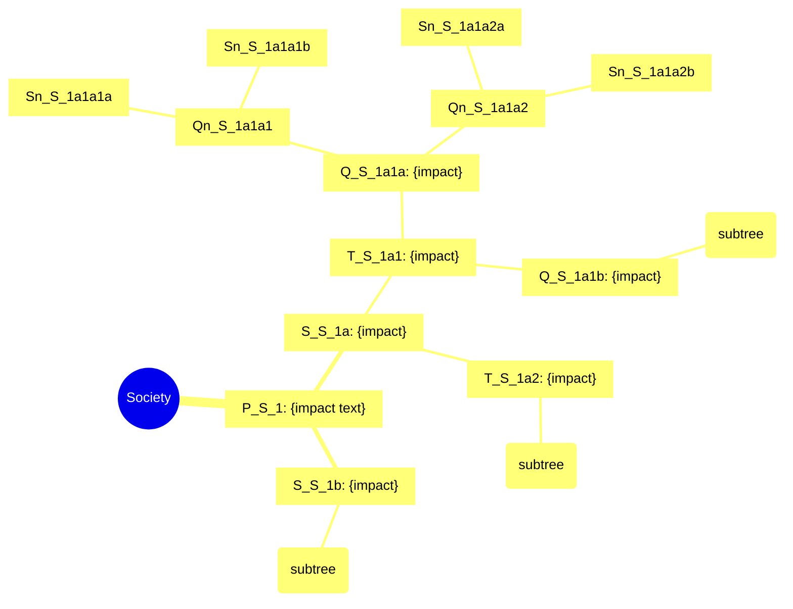
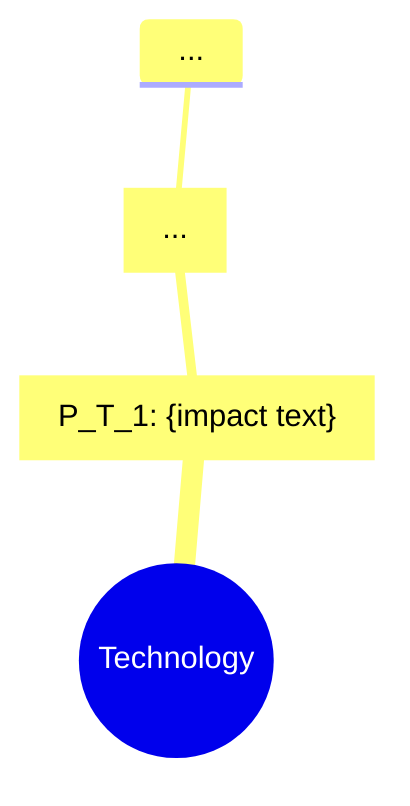

# 3LDP Templates — 3-Layer Display Protocol 양식

> 출처: SKILL.md §4 Phase 9, 박사님 2026-05-11 강화 명령 #13 (3LDP)
> 용도: Phase 9에서 Claude가 그대로 채워 쓰는 출력 양식

---

## Layer 1 — Executive Summary (~1 page)

```markdown
# SCBE Executive Summary
## {Center Issue} × STEEPS Categorical Binary Expansion

**분석 날짜**: {YYYY-MM-DD}
**프레임**: STEEPS 6 / V2 8-sector (선택)
**총 노드**: 379 (STEEPS 6) / 505 (V2 8-sector)
**Fan-out**: 균일 2^n (6차 = 카테고리당 32 senary 노드)

---

## STEEPS Categorical Senary Synthesis

### Society 6차 narrative (32 nodes 핵심 패턴)
{Society 카테고리의 6차 32 노드 중 핵심 narrative 1 문단.
가장 강한 세옹지마 역전 시퀀스와 종착점 기술.}

### Technology 6차 narrative
{...}

### Economy 6차 narrative
{...}

### Environment 6차 narrative
{...}

### Politics 6차 narrative
{...}

### Spirituality 6차 narrative
{...}

---

## 세옹지마 Reversal Trace (6 라인)

```
Society:      P🟢 → S🔴 → T🔴 → Q🟢 → Qn🟢 → Sn🟡
Technology:   P🟢 → S🟢 → T🔴 → Q🟢 → Qn🔴 → Sn🟢
Economy:      P🔴 → S🔴 → T🟢 → Q🟡 → Qn🟢 → Sn🟢
Environment:  P🔴 → S🔴 → T🟡 → Q🟢 → Qn🟢 → Sn🟡
Politics:     P🔴 → S🟡 → T🔴 → Q🟢 → Qn🔴 → Sn🟢
Spirituality: P🟡 → S🟢 → T🟢 → Q🔴 → Qn🟢 → Sn🟢
```

**SRS avg**: {X.XX} — {EXCELLENT / ACCEPTABLE / REVISIONS_REQUIRED}

---

## Cross-Domain Influence Top 3
1. {strongest}: {count}회 연결 (현 시대 지배적 상호작용)
2. {2nd}: {count}회
3. {3rd}: {count}회

---

## Key Findings (3 bullet)
- **{주요 발견 1}**: ...
- **{주요 발견 2}**: ...
- **{주요 발견 3}**: ...
```

---

## Layer 2 — Categorical Tree (6 collapsible mermaid)

```markdown
<details>
<summary><b>▶ Society Tree (1+2+4+8+16+32 = 63 nodes)</b></summary>



</details>

<details>
<summary><b>▶ Technology Tree (63 nodes)</b></summary>



</details>

<details>
<summary><b>▶ Economy Tree (63 nodes)</b></summary>
{...}
</details>

<details>
<summary><b>▶ Environment Tree (63 nodes)</b></summary>
{...}
</details>

<details>
<summary><b>▶ Politics Tree (63 nodes)</b></summary>
{...}
</details>

<details>
<summary><b>▶ Spirituality Tree (63 nodes)</b></summary>
{...}
</details>
```

---

## Layer 3 — Full Node Catalog (부록 또는 별도 파일)

```markdown
# Full Node Catalog
## {Center Issue} — STEEPS Categorical Binary Expansion

**총 노드**: 379 (Center 1 + 카테고리당 63 × 6)
**생성일**: {YYYY-MM-DD}

---

### Society Category (63 nodes)

#### Primary Ring (1 node)

##### P_S_1
- **Impact**: {impact text}
- **Sign**: 🟢 (+positive)
- **Time**: T+1~5y (Primary, Near-term)
- **Tags**: primary=Society, secondary=[]
- **Reasoning Chain**:
  - Step 1 [R-1, base fact]: {검증 가능 사실} — [{저자, 연도, URL}]
  - Step 2 [R-2, intermediate]: {중간 추론} — [{citation}]
  - Step 3 [H, leap]: {추론 도약} — Disclosed assumption: {가정 명시}
- **Evidence**: {backlash/paradigm/civilizational analog if applicable}

---

#### Secondary Ring (2 nodes)

##### S_S_1a
- **Impact**: {...}
- **Sign**: 🔴
- **Time**: T+5~10y (Secondary, Medium-term)
- **Tags**: primary=Society, secondary=[Technology]
- **Reasoning Chain**: ...

##### S_S_1b
{...}

---

#### Tertiary Ring (4 nodes)
##### T_S_1a1 {...}
##### T_S_1a2 {...}
##### T_S_1b1 {...}
##### T_S_1b2 {...}

---

#### Quaternary Ring (8 nodes) — 세옹지마 1차 반전 포함
##### Q_S_1a1a {...}
... (8 nodes)

---

#### Quinary Ring (16 nodes) — 세옹지마 2차 반전 포함
##### Qn_S_1a1a1 {...}
... (16 nodes)

---

#### Senary Ring (32 nodes) — 세옹지마 3차 반전 + 문명 단위
##### Sn_S_1a1a1a {...}
... (32 nodes)

---

### Technology Category (63 nodes)
{동일 구조 반복}

### Economy Category (63 nodes)
{...}

### Environment Category (63 nodes)
{...}

### Politics Category (63 nodes)
{...}

### Spirituality Category (63 nodes)
{...}
```

---

## 가독성 규칙 (Layer 선택 기준)

| 상황 | 권장 Layer |
|------|-----------|
| 경영진 브리핑, 정책 요약 | Layer 1 only |
| 워크숍, 발표, 시각화 | Layer 1 + Layer 2 |
| 학술 논문, 단행본 챕터 | Layer 1 + 2 + 3 |
| 데이터 분석, 후속 연구 | Layer 3 only |

## 토큰 절약 (Layer 3 생략 시)

Layer 3는 기본 출력에서 **생략** 가능. `layer_output.layer_3: false`로 설정 시 Layer 1+2만 생성.
Layer 3는 별도 markdown 파일로 저장하거나 요청 시 개별 카테고리 단위로 생성.
