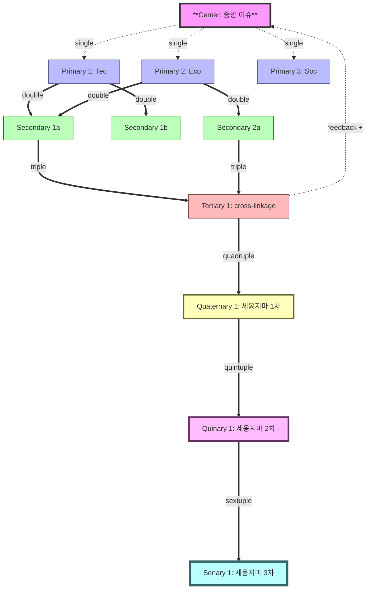

# Sub-skill: Consequence Linker

> **출처**: Glenn, J.C. (2009). "Futures Wheel." In J.C. Glenn & T.J. Gordon (Eds.), *Futures Research Methodology*, Version 3.0 (Ch. 6, §III.B, §IV, Figure 4). Washington, DC: AC/UNU Millennium Project.
> **상위 마스터**: `vision-foresight-futures-wheel`
> **호출 권한**: 마스터 orchestration 전용 (disable-model-invocation: true)
> **결정론 엔진**: `consequence_linker_engine.py` (동일 폴더)

---

## 0. 핵심 정의 (할루시네이션 봉쇄)

### 0.1 Sign 인코딩 표준

| 기호 | 정수 | 의미 |
|------|------|------|
| 🟢 | +1 | Positive/beneficial consequence |
| 🔴 | -1 | Negative/harmful consequence |
| 🟡 |  0 | Neutral/uncertain/mixed |

**Sign 부여 기준**: 노드의 텍스트 설명과 도메인 맥락을 기반으로 LLM이 판단. 복합적이면 🟡. 단, 판단 이후의 모든 수치 연산은 Python 결정론 엔진으로 처리.

### 0.2 세옹지마 전이(Sign Reversal) 정의

> **세옹지마 전이** = 인접 sign 간 **+1→-1** 또는 **-1→+1** 전환.
> 🟡(0)은 전이 양쪽 모두에서 reversal로 집계되지 않는다.
> 출처: 塞翁之馬 개념의 계량화. Glenn §III.B의 line distinction 구조에서 고차 결과일수록 초기 trend와 반전될 가능성을 측정.

### 0.3 SRS 임계값 (consequence-linker 전용)

> **주의**: 아래 임계값은 박사님 2026-05-11 6차 강화 규칙이며, Glenn (2009) 원전에 없다. parent `wheel_math.py`의 excellent≥1.5와 다르게 **excellent≥2.0**을 사용한다. 이유: 6차 causal layer(C→P→S→T→Q→Qn→Sn)에서 더 강한 비선형성 증거가 요구되기 때문.

| 분류 | avg reversal | 판정 |
|------|-------------|------|
| excessive | > 3.5 | WARN (wishful thinking 의심) |
| excellent  | ≥ 2.0 | PASS |
| good       | ≥ 1.5 | PASS |
| acceptable | ≥ 1.0 | PASS |
| insufficient | < 1.0 | REJECT |

---

## 1. PDF 원전 정의

Glenn(2009) 직접 인용:

### 1.1 Line Distinction (§III.B)

> *"The Futures Wheel can show distinctions between primary, secondary, and tertiary consequences in another way. Instead of rings, one can draw single lines from the central oval to the primary impacts, double lines between the primary and secondary impacts, and triple lines between the secondary and tertiary impacts. Using this approach, the Futures Wheel shown in Figure 4 illustrates the possibility of cross-linkage of impacts."*

### 1.2 NSA Snyder Cross-linkage Example (§III.B)

> *"For example, 'increased funds required for software' is a primary consequence of the National Security Agency (NSA) experiencing 'growing costs for and dependence on acquisition and maintenance of software,' a secondary consequence of 'increased dependency on contractors,' and a tertiary consequence of 'increased costs' in general."*

> *"This Futures Wheel developed by Futurist David Snyder during consulting with the U.S. National Security Agency, illustrates the use of single, double, and triple lines to represent primary, secondary, and tertiary impacts (reprinted with permission of the author.)"*

### 1.3 Feedback Loop (§IV)

> *"The Futures Wheel can help identify positive and negative feedback loops. The higher-order consequences occasionally cycle back to the original item (e.g., more highways produce more drivers, produce more congestion, produce still more highways). This sequential process is a natural way to tie the Futures Wheel into the development of a formal systems model."*

### 1.4 Contradiction Detection (§IV)

> *"The Futures Wheel can also yield contradictory impacts. For example, in the Futures Wheel on the National Security Agency (see Fig. 4), one secondary consequence on the left side of the wheel is 'more control' and another secondary consequence on the left side was 'less control.' These two impacts come from different primary consequences and, together, identify the critical issue of how management could react differently to the same event. Thus the ability to reveal contradiction may actually be a strength of the method."*

---

## 2. AI Agent 6인 구성

| Agent | 역할 |
|-------|------|
| **Leader Agent** | line distinction 진행, ring 방식과 비교, 8 Phase 전체 오케스트레이션 |
| **Linker Agent** | 노드 간 cross-linkage 탐지, tree 아닌 graph 구성, Pattern A/B/C 식별 |
| **Contradiction Critic** | 양립 불가 짝 식별, critical issue 승격 |
| **Cycle Detector** | positive·negative feedback loop 탐지, DFS cycle 탐지 |
| **⭐ Sign Reversal Tracker** | 모든 lineage sign sequence 추출, 세옹지마 전이 계산, SRS 집계, 결정론 엔진 호출 |
| **Visualizer** | line thickness graphic + DAG diagram + adjacency matrix |

---

## 3. 8 Phase 처리 흐름

### Phase 1 — 6-Line Distinction Adoption

**출처**: Glenn §III.B + 박사님 2026-05-11 6차 강화 (Quaternary~Senary는 Glenn 원전에 없는 확장)

basic-v1의 9 Phase 산출(6 ring)을 line thickness 방식으로 *대체 표기*:

| 차수 | Line | 시각 표현 | 시간 | 출처 |
|-----|------|---------|------|------|
| Center → Primary | single | `─────` | T+1~5y | Glenn §III.B 원전 |
| Primary → Secondary | double | `═════` | T+5~10y | Glenn §III.B 원전 |
| Secondary → Tertiary | triple | `━━━━━` | T+10~20y | Glenn §III.B 원전 |
| Tertiary → Quaternary | **quadruple** | `▰▰▰▰▰` | T+15~25y (세옹지마 1차 반전) | 박사님 2026-05-11 확장 |
| Quaternary → Quinary | **quintuple** | `█████` | T+20~30y (세옹지마 2차) | 박사님 2026-05-11 확장 |
| Quinary → Senary | **sextuple** | `▓▓▓▓▓` | T+25~50y (세옹지마 3차) | 박사님 2026-05-11 확장 |

### Phase 2 — Cross-linkage Discovery

일반 tree 구조에서는 각 노드가 하나의 부모만 가진다. Linker Agent가 아래 패턴을 탐지하고 **결정론 엔진**(Pattern A·B는 Python)으로 검증:

**Pattern A — 다중 부모 (multi-parent)** [결정론: `detect_cross_linkages` → pattern_A]:

PDF NSA 사례 그대로:
```
Tertiary "increased costs"
  ↑ tertiary line from
Secondary "increased dependency on contractors"
  ↑ secondary line from
Primary "increased funds required for software"
  ↑ primary line from
[Center: NSA growing costs for software]

But ALSO: "increased funds required for software" appears as
  - tertiary in another chain
  - secondary in another chain
  - primary in another chain
```

같은 노드가 여러 인과 사슬 끝에 동시 등장 → 노드의 in-degree > 1 → 그래프 구조 필요.

```bash
python3 consequence_linker_engine.py detect_cross_linkages '<nodes_and_edges_json>'
# → pattern_A_multi_parent: [{node, parent_count, parents}]
```

**Pattern B — Skip-level linkage** [결정론: `detect_cross_linkages` → pattern_B]:

primary가 tertiary로 직접 연결(secondary 건너뛰기):
```
Center ──── Primary-1 ━━━━━━━━ Tertiary-X (gap=2, skips secondary)
```

**Pattern C — Cross-domain jump** [LLM + domain 메타데이터]:

도메인 A의 primary가 도메인 B의 primary와 직접 연결:
```
P-Tec-1 (Tech) ←→ P-Eco-1 (Economic): cross-jump linkage
```

### Phase 3 — Feedback Loop Detection

**출처**: Glenn §IV (*"more highways → more drivers → more congestion → more highways"*)

구조적 cycle 탐지는 결정론 엔진으로 처리:

```bash
python3 consequence_linker_engine.py detect_cycles '<adj_dict_json>'
# → cycles: [[node1, node2, ..., node1], ...]
```

cycle type (positive reinforcing / negative balancing)은 sign context가 필요하므로 LLM이 Glenn §IV 기준으로 판정.

```yaml
feedback_loops_detected:
  - loop_id: FL-1
    type: positive (reinforcing)
    nodes: [Center, P1, S1, T1, Center]
    chain: "AGI 도입 → 화이트칼라 해고 → 소비 감소 → 경제 성장 둔화 → AGI 도입 가속(인건비 절약)"
    cycle_period_estimate: "5~8y"

  - loop_id: FL-2
    type: negative (balancing)
    nodes: [Center, P3, S3, P3]
    chain: "AGI 도입 → 데이터센터 전력 수요 → 전기 요금 인상 → AGI 비용 증가 → 도입 속도 둔화"
    cycle_period_estimate: "3~5y"
```

**Loop type 분류**:
- **Positive (reinforcing/vicious or virtuous cycle)**: 동일 방향 자기 강화
- **Negative (balancing)**: 반대 방향 자기 조절

Glenn §IV: *"This sequential process is a natural way to tie the Futures Wheel into the development of a formal systems model."*

### Phase 4 — Contradiction Detection

**출처**: Glenn §IV NSA 사례

Contradiction Critic Agent가 양립 불가 짝 자동 탐지:

**구조적 탐지 기준** (결정론으로 환원 가능한 부분):
1. 동일 ring level (예: 모두 secondary)
2. 서로 다른 primary에서 파생
3. 텍스트 의미가 의미론적으로 반대 (이 판단은 LLM)

```yaml
contradictions_detected:
  - contradiction_id: CT-1
    ring_level: secondary
    nodes:
      A: { id: "S-Tec-1a", text: "AI가 정보 통제 강화", sign: "🟡" }
      B: { id: "S-Soc-3b", text: "AI 우회로 정보 통제 불가", sign: "🟡" }
    different_parents: true  # 다른 primary 출신 [결정론 검증 가능]
    critical_issue: "AGI 시대 정보 통제 가능성에 대한 management의 대응 차이"
    promote_to: "scenario-forecast 분기점"

  - contradiction_id: CT-2
    ring_level: secondary
    nodes:
      A: { id: "S-Eco-2a", text: "임금 정체로 소비 감소", sign: "🔴" }
      B: { id: "S-Eco-4c", text: "AI 효율로 가격 하락, 실질 구매력 증가", sign: "🟢" }
    different_parents: true
    critical_issue: "소비 시장 미래는 명목 vs 실질 어느 효과가 우세한가"
    promote_to: "scenario branching"
```

Glenn 명시: *"The ability to reveal contradiction may actually be a strength of the method."*

본 sub-skill은 contradiction을 *결함*이 아니라 *통찰의 신호*로 다룬다.

### Phase 5 — Graph Construction

ring/tree가 아닌 **DAG + cycle 허용 graph**:

```python
# Conceptual structure (결정론 엔진에 전달하는 JSON 형식)
graph = {
  "nodes": [
    {"id": "Center",  "type": "center",     "domain": "common", "text": "...", "sign": 0},
    {"id": "P1",      "type": "primary",    "domain": "Tec",    "text": "...", "sign": 1},
    {"id": "P2",      "type": "primary",    "domain": "Eco",    "text": "...", "sign": -1},
    {"id": "S1",      "type": "secondary",  "domain": "Soc",    "text": "...", "sign": 1},
    {"id": "Q1",      "type": "quaternary", "domain": "Tec",    "text": "...", "sign": -1},
    {"id": "Qn1",     "type": "quinary",    "domain": "Tec",    "text": "...", "sign": 1},
    {"id": "Sn1",     "type": "senary",     "domain": "Tec",    "text": "...", "sign": -1},
  ],
  "edges": [
    {"from": "Center", "to": "P1",  "line": "single"},
    {"from": "Center", "to": "P2",  "line": "single"},
    {"from": "P1",     "to": "S1",  "line": "double"},
    {"from": "P2",     "to": "S1",  "line": "double", "cross_link": true},
    {"from": "S1",     "to": "T1",  "line": "triple"},
    {"from": "T1",     "to": "Q1",  "line": "quadruple"},
    {"from": "Q1",     "to": "Qn1", "line": "quintuple"},
    {"from": "Qn1",    "to": "Sn1", "line": "sextuple"},
    {"from": "T1",     "to": "Center", "line": "feedback", "loop_id": "FL-1"},
  ]
}
```

**결정론 엔진 호출**:

```bash
# Adjacency matrix
python3 consequence_linker_engine.py adjacency_matrix '<graph_json>'

# Graph metrics
python3 consequence_linker_engine.py graph_metrics '<graph_json>'

# Cross-linkage detection
python3 consequence_linker_engine.py detect_cross_linkages '<graph_json>'

# Cycle detection
python3 consequence_linker_engine.py detect_cycles '<adj_dict_json>'
```

### Phase 6 — Per-Lineage Sign Sequence Trace ⭐

**박사님 2026-05-11 6차 강화 (Glenn 원전에 없는 확장)**

**결정론 엔진 필수 호출** (LLM이 직접 카운팅하지 않는다):

```bash
python3 consequence_linker_engine.py count_reversals '{"signs": [sign_sequence_list]}'
```

graph의 모든 lineage(Center에서 시작해 Senary까지 도달하는 경로)를 추출하여 sign sequence 분석:

```yaml
lineage_extraction:
  for each path (Center → P{n} → S{n}a → T{n}a1 → Q{n}a1a → Qn{n}a1a1 → Sn{n}a1a1α):
    sign_sequence_int: [+1, -1, -1, +1, +1, -1]
    sign_sequence_emoji: [🟢, 🔴, 🔴, 🟢, 🟢, 🔴]
    engine_output:
      reversal_count: 3
      reversal_positions:
        - "0→1: 🟢→🔴 (세옹지마 전이)"
        - "2→3: 🔴→🟢 (세옹지마 전이)"
        - "4→5: 🟢→🔴 (세옹지마 전이)"
    classification:
      reversal_pattern: "Positive→Negative→Positive→Negative"
      worth_attention: "다중 반전 — T+10y, T+20y 즈음 분기점"
```

각 lineage가 *세옹지마* 패턴(비선형 반전)을 보이는지 *직선적* 패턴인지 분류.

### Phase 7 — SRS Aggregation ⭐

**박사님 2026-05-11 6차 강화 (Glenn 원전에 없는 확장)**

**결정론 엔진 필수 호출**:

```bash
python3 consequence_linker_engine.py linker_srs_score '{"lineages": [[...],[...],...]}'
python3 consequence_linker_engine.py linker_forced_compliance '{"lineages": [[...],[...],...]}'
```

```yaml
global_SRS:
  total_lineages_traced: N
  per_lineage_reversals: [2, 3, 1, 2, 3, ...]
  avg_reversal: X.XX       # Python engine output — LLM이 계산하지 않음

  classification:           # Python engine output
    excellent: avg ≥ 2.0
    good: 1.5 ≤ avg < 2.0
    acceptable: 1.0 ≤ avg < 1.5
    insufficient: < 1.0 → REJECT (직선적 단정)

  forced_reversal_compliance:  # Python engine output
    P→Q (Tertiary→Quaternary):
      rate: X.XX
      required: 0.50
      status: PASS/FAIL
    Q→Qn (Quaternary→Quinary):
      rate: X.XX
      required: 0.50
      status: PASS/FAIL
    Qn→Sn (Quinary→Senary):
      rate: X.XX
      required: 0.50
      status: PASS/FAIL
    overall_pass: true/false

  excessive_reversal_guard:    # Python engine output
    threshold: avg > 3.5 → WARN (wishful thinking 의심, plausibility 재검증)

  export_to: quality-control Gate 10
```

### Phase 8 — Linkage Quality Report

**결정론 엔진 호출로 수치 산출** (`graph_metrics` 결과를 그대로 사용):

```yaml
linkage_quality_report:
  total_nodes: N          # graph_metrics 출력 — LLM이 세지 않음
  total_edges: E          # graph_metrics 출력
  graph_density: X.XXX    # graph_metrics 출력

  by_line_type:           # graph_metrics.edges_by_line_type 출력
    single: N1            # Center→Primary (Glenn 원전)
    double: N2            # Primary→Secondary (Glenn 원전)
    triple: N3            # Secondary→Tertiary (Glenn 원전)
    quadruple: N4         # Tertiary→Quaternary (박사님 확장)
    quintuple: N5         # Quaternary→Quinary (박사님 확장)
    sextuple: N6          # Quinary→Senary (박사님 확장)
    feedback: Nf          # Cycle feedback edges (Glenn §IV)
    cross: Nx             # Cross-link/skip-level edges

  cross_linkage_count: K   # detect_cross_linkages 출력
  fan_in_max: X            # graph_metrics 출력
  fan_out_max: Y           # graph_metrics 출력
  longest_path: Z          # graph_metrics 출력

  cycle_count: M           # detect_cycles 출력
  cycle_details:
    - FL-1: positive 5~8y
    - FL-2: negative 3~5y
    - FL-3: positive 10~20y

  contradiction_count: K
  contradiction_critical_issues: [CT-1, CT-2]

  srs_summary:             # linker_srs_score 출력
    avg_reversal: X.XX
    classification: excellent|good|acceptable|insufficient
    status: PASS|REJECT|WARN

  forced_compliance_summary:  # linker_forced_compliance 출력
    overall: PASS|FAIL
    by_transition: { "P→Q": PASS/FAIL, "Q→Qn": PASS/FAIL, "Qn→Sn": PASS/FAIL }

  systems_model_readiness: high|medium|low
```

---

## 4. 출력 표준 형식

### 4.1 Mermaid Flowchart (DAG + cross-linkage, 6차 노드 포함)



### 4.2 NSA Snyder Style Wheel (line thickness 강조)

```
                      ┌── Lower Costs ──┐
              Less    │                 │   More
            Control ──┼── Rapid Response│   Costs
                      │                 │
        Loss of       │  Increased      │   Increased
        In-house ─────│  Flexibility    │── Security
        Skills        │  ───────────────│   Concerns
                      │                 │
                      │  Increased      │
        Increased ════│  Dependence on  │
        Funds for     │  Contractors    │
        Software      │  ╔══════════╗   │
                      │  ║ [NSA Cost ║   │
                      │  ║   Center] ║   │
                      │  ╚══════════╝   │
        Reduced ═════════════════════════
        Productivity
                      │                 │
        Impact on ════│                 │═══ Higher
        Mission       │                 │    Risks
                      └─────────────────┘
```

(Glenn Figure 4를 line thickness로 표현)

### 4.3 Adjacency Matrix (결정론 엔진 출력 — LLM이 생성하지 않음)

```bash
python3 consequence_linker_engine.py adjacency_matrix '<graph_json>'
```

값 인코딩:

| 값 | 의미 | 출처 |
|----|------|------|
| 1 | single (Center→Primary) | Glenn §III.B 원전 |
| 2 | double (Primary→Secondary) | Glenn §III.B 원전 |
| 3 | triple (Secondary→Tertiary) | Glenn §III.B 원전 |
| 4 | quadruple (Tertiary→Quaternary) | 박사님 확장 |
| 5 | quintuple (Quaternary→Quinary) | 박사님 확장 |
| 6 | sextuple (Quinary→Senary) | 박사님 확장 |
| -1 | feedback loop | Glenn §IV |
| 0 | no edge | — |
| - | diagonal | — |

예시 출력:

```markdown
|        | Center | P1 | P2 | S1a | S1b | T1 | Q1 | Qn1 | Sn1 |
|--------|--------|----|----|-----|-----|----|----|-----|-----|
| Center |    -   |  1 |  1 |  0  |  0  |  0  |  0 |  0  |  0  |
| P1     |    0   |  - |  0 |  2  |  2  |  0  |  0 |  0  |  0  |
| P2     |    0   |  0 |  - |  2  |  0  |  0  |  0 |  0  |  0  |
| S1a    |    0   |  0 |  0 |  -  |  0  |  3  |  0 |  0  |  0  |
| S1b    |    0   |  0 |  0 |  0  |  -  |  0  |  0 |  0  |  0  |
| T1     |   -1   |  0 |  0 |  0  |  0  |  -  |  4 |  0  |  0  |
| Q1     |    0   |  0 |  0 |  0  |  0  |  0  |  - |  5  |  0  |
| Qn1    |    0   |  0 |  0 |  0  |  0  |  0  |  0 |  -  |  6  |
| Sn1    |    0   |  0 |  0 |  0  |  0  |  0  |  0 |  0  |  -  |
```

### 4.4 Causal Loop Diagram Export (System Dynamics)

Glenn §IV: *"a natural way to tie the Futures Wheel into the development of a formal systems model"*

feedback loop를 CLD 표기로 export:

```
[AGI 도입] ─(+)→ [화이트칼라 해고]
[화이트칼라 해고] ─(−)→ [소비]
[소비] ─(+)→ [경제 성장]
[경제 성장] ─(−)→ [AGI 도입 비용 압박]
[AGI 도입 비용 압박] ─(+)→ [AGI 도입]  // R loop (reinforcing)
```

### 4.5 SRS Report (Phase 6·7 결정론 출력)

```yaml
srs_report:
  engine: "consequence_linker_engine.py::linker_srs_score"
  lineage_count: N
  per_lineage_reversals: [2, 1, 3, 2, 1, ...]
  avg_srs: X.XX
  classification: excellent|good|acceptable|insufficient|excessive
  status: PASS|REJECT|WARN
  verdict: "PASS EXCELLENT: avg=2.30 ≥ 2.0"

  forced_compliance:
    engine: "consequence_linker_engine.py::linker_forced_compliance"
    P→Q: { rate: 0.75, status: PASS }
    Q→Qn: { rate: 0.60, status: PASS }
    Qn→Sn: { rate: 0.55, status: PASS }
    overall: PASS

  export_to: quality-control Gate 10
```

---

## 5. Python 결정론 모듈

**파일**: `consequence_linker_engine.py` (동일 폴더)

LLM이 자연어로 재추론하지 못하도록 봉쇄된 연산 목록:

| 연산 | 함수 | CLI 명령 |
|------|------|---------|
| Adjacency matrix 구성 | `adjacency_matrix()` | `adjacency_matrix` |
| Cross-linkage 구조 탐지 (Pattern A·B·C) | `detect_cross_linkages()` | `detect_cross_linkages` |
| Cycle detection (DFS) | `detect_cycles()` | `detect_cycles` |
| Graph 지표 (density, fan-in/out, longest path) | `graph_metrics()` | `graph_metrics` |
| Sign reversal 카운팅 (🟢↔🔴) | `count_reversals()` | `count_reversals` |
| SRS aggregation (consequence-linker 임계값) | `linker_srs_score()` | `linker_srs_score` |
| Forced reversal compliance (P→Q·Q→Qn·Qn→Sn ≥50%) | `linker_forced_compliance()` | `linker_forced_compliance` |

**CLI 사용법**:

```bash
python3 consequence_linker_engine.py <command> '<json_args>'
# 예:
python3 consequence_linker_engine.py count_reversals '{"signs": ["🟢","🔴","🟢","🔴","🟢","🔴"]}'
python3 consequence_linker_engine.py linker_srs_score '{"lineages": [[1,-1,1,-1,1,-1],[1,1,-1,1,-1,1]]}'
```

**결정론 환원 불가 항목** (LLM이 판단하되 출처 1:1 대조 필수):

| 판단 | 근거 출처 |
|------|---------|
| 노드 sign (+1/-1/0) 부여 | 텍스트 의미 + 도메인 맥락 — LLM 판단 + 박사님 확인 |
| Feedback loop 타입 (positive/negative) | Glenn §IV 정의 1:1 대조 |
| Contradiction 쌍 식별 (의미론적 반대) | Glenn §IV NSA 사례 1:1 대조 |
| CLD 인과 부호 (+/-) | System Dynamics 표준 (Sterman 2000) 1:1 대조 |

---

## 6. PDF 인용 fragment

> *"Instead of rings, one can draw single lines from the central oval to the primary impacts, double lines between the primary and secondary impacts, and triple lines between the secondary and tertiary impacts."* (§III.B)

> *"The Futures Wheel can help identify positive and negative feedback loops... a natural way to tie the Futures Wheel into the development of a formal systems model."* (§IV)

> *"The ability to reveal contradiction may actually be a strength of the method."* (§IV)

---

## 7. 마스터 입력 인터페이스

```yaml
sub_skill: vision-foresight-futures-wheel-consequence-linker
inputs:
  prior_wheel_output:           # basic-v1 또는 domain-v2 산출물
    nodes: [...]                # 각 노드: {id, type, domain, text, sign}
    initial_edges: [...]        # tree 구조 엣지: {from, to, line}
  enable_cross_linkage: true
  enable_feedback_loop: true
  enable_contradiction: true
  enable_sign_reversal_trace: true   # Phase 6 활성화 (박사님 2026-05-11)
  enable_srs_aggregation: true       # Phase 7 활성화 (박사님 2026-05-11)
  max_cycle_search_depth: 5
  srs_thresholds:                    # 기본값 = consequence-linker 전용 임계값
    excellent: 2.0
    good: 1.5
    acceptable: 1.0
    excessive: 3.5
  forced_reversal_minimum: 0.50      # 기본 50%
outputs:
  - graph_dag_representation
  - mermaid_flowchart
  - adjacency_matrix
  - feedback_loops
  - contradictions
  - causal_loop_diagram
  - linkage_quality_report
  - srs_report                       # Phase 6·7 출력 (박사님 추가)
  - per_lineage_trace                # Phase 6 lineage별 sign sequence
  - pdf_citations
```

---

## 8. 호출 후 마스터로 반환

```yaml
sub_skill_output:
  status: completed
  graph_density: X.XXX
  cross_linkage_count: N
  feedback_loop_count: M
  contradiction_count: K
  critical_issues_promoted: [CT-1, CT-2]   # scenario-forecast로 escalate 후보
  systems_model_readiness: high|medium|low

  srs_summary:                        # Phase 7 출력 (박사님 2026-05-11 추가)
    avg_reversal: X.XX
    classification: excellent|good|acceptable|insufficient|excessive
    status: PASS|REJECT|WARN
    forced_compliance:
      P_to_Q: PASS|FAIL
      Q_to_Qn: PASS|FAIL
      Qn_to_Sn: PASS|FAIL
      overall: PASS|FAIL

  per_lineage_trace:                  # Phase 6 출력 (박사님 2026-05-11 추가)
    - lineage_id: "Center→P1→S1a→T1→Q1→Qn1→Sn1"
      sign_sequence: [🟢, 🔴, 🔴, 🟢, 🟢, 🔴]
      reversal_count: 3
      classification: "세옹지마 다중 반전"
    - ...

  visualizations: { mermaid: "...", adjacency_matrix: "...", cld: "..." }
  pdf_citations: [
    "Glenn (2009) §III.B line distinction",
    "Glenn (2009) §IV feedback loops",
    "Glenn (2009) §IV contradictions"
  ]
```

마스터는 critical_issues를 `scenario-forecast` sub-skill로 escalate.

---

## 9. references/

| 파일 | 용도 |
|------|------|
| `references/snyder_nsa_linkage.md` | Figure 4 NSA Snyder 사례 상세 재현 |
| `references/feedback_loop_taxonomy.md` | positive·negative loop 분류 + System Dynamics 변환 |
| `references/contradiction_detection_algorithm.md` | 양립 불가 짝 자동 식별 알고리즘 |
| `references/causal_loop_diagram_export.md` | DAG → CLD 표기 변환 가이드 |
