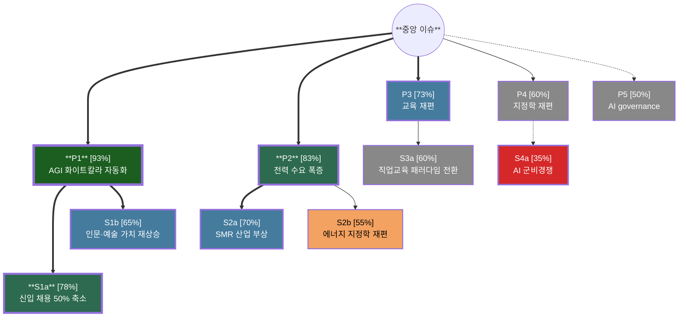

# Sub-skill: Delphi Wheel (5-round async + Wiki)

> **출처**: Glenn, J. C. (2009). "Futures Wheel." *Futures Research Methodology V3.0*, Ch.6 §VI. Millennium Project. ISBN: 978-0-9818941-1-3.
> **상위 마스터**: `vision-foresight-futures-wheel`
> **호출 권한**: 마스터 orchestration 전용 (disable-model-invocation: true)
> **Cross-skill**: `foresight-expert-pool` · `foresight-delphi` · `foresight-realtime-delphi` · `foresight-futures-polygon`
> **결정론 모듈**: `delphi_utils.py` (수치 계산 전량 위임 — LLM 자연어 추정 금지)

## 1. PDF 원전 정의

Glenn(2009) 직접 인용 (Frontiers section):

> *"Another future variation of the Futures Wheel could use a Delphi via the Internet. An international panel could assemble asynchronously to systematically construct a Futures Wheel:"*

> *"**Round 1**: Ask an international panel to rate a list of events or trends for use with a Futures Wheel and or ask for additional suggestions;"*

> *"**Round 2**: Feed back the panel's responses for further refinement, clarification, and ranking;"*

> *"**Round 3**: Request respondents to list primary consequences of the trends or events of highest ranking;"*

> *"**Round 4**: Display results as a Futures Wheel with just the primary ring of impacts; the size of the oval around each primary impact could represent the frequency with which the panel identified it; then ask for the secondary impacts;"*

> *"**Round 5**: Display primary impacts as first ring, and secondary impacts as a second ring; again, the size of the ovals (or some other graphic device) could represent the frequency of responses."*

> *"This approach could also use the ideas in the Futures Polygon for expressing consequences."*

> *"These versions of the Futures Wheel could be assisted by collaborative software or groupware, which would collect and display the panel's views on the impacts in the graphic of a Futures Wheel."*

> *"Futures Wheel Wikis could be created by letting geographically dispersed people add to and/or edit the consequences via the Internet."*

## 2. AI Agent 6 종 구성

| Agent | 역할 | 인원 |
|-------|------|------|
| **Round Coordinator** | round 진행, 사용자 입력 통합, anonymity 유지 | 1 |
| **Async Panelists** | `foresight-expert-pool`에서 캐스팅. 5~30인. 다양한 도메인·국가·관점 | 5~30 |
| **Aggregator** | round 별 응답 anonymous 집계, ranking·frequency 계산 (`delphi_utils.py::aggregate_composite_ratings` 실행) | 1 |
| **Frequency Counter** | impact 별 빈도 카운트, oval size 비율 결정 (`delphi_utils.py::count_impact_frequencies` 실행) | 1 |
| **Wiki Editor** | Wiki collab phase에서 contribution·edit history 관리 | 1 |
| **Visualizer** | frequency-weighted oval wheel + Round 별 시각화 | 1 |

## 3. 8 Phase 처리 흐름

### Phase 1 — Panel Recruitment

Async Panelists 5~30인을 `foresight-expert-pool` cross-skill로 캐스팅. 다양성 차원:

```yaml
panel_diversity_dimensions:
  domain:
    - Technologist (예: Jerome Glenn 본인·Bishop·Coates·Voros)
    - Economist
    - Sociologist
    - Policy Maker
    - Industry Practitioner
    - Academia
    - Civic Society
  geography:
    - North America
    - Europe
    - East Asia (KR/JP/CN)
    - Global South
  perspective:
    - Optimist
    - Pessimist
    - Pragmatist
    - Critic
  age_cohort:
    - Boomer
    - Gen X
    - Millennial
    - Gen Z
```

**최소 다양성 강제**: 도메인 4종 이상, 지리 3종 이상, 관점 3종 이상.

> **[결정론 검증 — Phase 1 필수]** 패널 확정 후 반드시 Python으로 다양성 점수 계산:
> ```bash
> python3 delphi_utils.py diversity_score '<json_panelist_list>'
> ```
> `minimums_met: false` 이면 추가 패널 리크루팅 없이 Round 1 진입 금지.
> `score < 0.40` 이면 마스터 오케스트레이터에 경고.
> → 상세: `references/panel_diversity_matrix.md`

### Phase 2 — Round 1: List Rating + Suggestions

각 Async Panelist에게 anonymous 동시 제시:

```markdown
## Round 1 (Anonymous)

다음은 Futures Wheel 분석 후보 trend·event list입니다.
각 항목에 대해 다음을 답해주세요:

1. **중요도 (1~5)**: Futures Wheel 분석 가치
2. **임팩트 (1~5)**: 잠재 사회 영향
3. **확실성 (1~5)**: 발생 가능성

추가로 제안하고 싶은 trend·event가 있으면 자유롭게 적어주세요.

### 후보 list
- [ ] {trend 1}
- [ ] {trend 2}
- [ ] {event 1}
- ...
```

Aggregator가 anonymous 응답 수집·집계.

> **[결정론 — Round 1 집계]** 평균·표준편차·순위는 LLM이 추정하지 않고 Python으로 계산:
> ```bash
> python3 delphi_utils.py aggregate_composite '<json_ratings_by_item>'
> ```
> 입력 형식: `{"trend_name": {"importance": [4,5,3,...], "impact": [5,4,4,...], "certainty": [3,4,3,...]}}`
> 출력: composite_mean, dim_means, std_dev_pooled, divergence_flag, top_candidate(bool)
> Top 후보 기준: `composite_mean = avg(importance, impact, certainty) ≥ 4.0` (자동 ★ 표시)

### Phase 3 — Round 2: Feedback + Refinement

Round 1 집계 결과를 panel에 redistribute:

```markdown
## Round 2 (Anonymous)

Round 1 종합 결과를 공유합니다. 다음을 답해주세요:

1. 본인의 평가가 panel 평균과 다르면 *이유* 명시
2. 새 trend 제안 중 어떤 것이 가장 가치 있는지 ranking
3. trend·event 정의를 명료화하기 위한 refinement 제안

### Round 1 종합 (aggregate_composite_ratings() 출력 기반 자동 생성)
| Trend/Event | 평균 중요도 | 평균 임팩트 | 평균 확실성 | Top 후보 |
|-------------|-----------|-----------|-----------|---------|
| {trend_label_1} | 4.2 | 4.5 | 3.8 | ★ |
| {trend_label_2} | 3.8 | 3.5 | 4.1 |   |
| {trend_label_N} | ... | ... | ... | ... |

### 새로 제안된 trend (Round 1 panel 추가)
- {new trend A} (3 panelists 제안)
- {new trend B} (1 panelist 제안)
```

### Phase 4 — Round 3: Primary Consequences

Round 2에서 highest-ranked trend·event 선정 후:

> **[결정론 — highest-ranked 선정]** Round 2 재평가 후 순위 재계산:
> ```bash
> python3 delphi_utils.py aggregate_composite '<updated_json>'
> ```
> 최고 `composite_mean` 항목을 Top Trend로 선정. 동점 시 `std_dev_pooled` 낮은 항목 우선 (합의도 기준).

```markdown
## Round 3 (Anonymous)

Round 2 결과 panel이 가장 가치 있다고 동의한 trend는:
> **"{Top Trend}"** (composite score: {composite_mean}/5, panel consensus: {std_dev})

이 trend의 **primary consequence(직접 영향)**를 자유롭게 list해주세요.
- 시간 범위: T+1~5y
- 개수: 자유 (보통 3~10개)
- 형식: 짧은 phrase
```

Aggregator가 각 panelist의 primary list 수집.

### Phase 5 — Round 4: Frequency-weighted Primary + Ask Secondary

Frequency Counter가 모든 primary impact 빈도 집계:

```yaml
primary_frequency:
  "AGI로 화이트칼라 자동화": 28/30 panelists  # 93% — biggest oval
  "데이터센터 전력 수요 폭증": 25/30 panelists  # 83%
  "교육 시스템 재편": 22/30 panelists  # 73%
  "지정학 재편": 18/30 panelists  # 60%
  "AI governance 입법 가속": 15/30 panelists  # 50%
  # (further items...)
```

> **[결정론 — 빈도 계산 및 oval size 매핑]** LLM이 추정하지 않고 반드시 Python 실행:
> ```bash
> # 빈도 카운트 + oval size 자동 매핑
> python3 delphi_utils.py count_frequencies '<json_list_of_lists>' <panel_size>
> ```
> 입력: 각 panelist의 primary impact 목록 (list of lists)
> 출력: {impact: {count, frequency, frequency_pct, oval_size}} 빈도 내림차순
> → 상세 매핑 테이블: `references/frequency_weighted_oval.md`

빈도 → oval size 매핑 (PDF 명시, Glenn §VI Round 4):

| Frequency | Oval Size | 시각 |
|-----------|----------|------|
| 90~100% | XL | ⬭ ⬭ ⬭ (가장 큰 oval) |
| 70~89% | L | ⬭ ⬭ |
| 50~69% | M | ⬭ |
| 30~49% | S | ◯ |
| <30% | XS | · |

이어서 panel에 redistribute:

```markdown
## Round 4

다음은 panel이 식별한 primary impacts입니다 (oval 크기 = panel 동의 빈도).

[Frequency-weighted Wheel 시각화]

각 primary impact별로 **secondary impact(2차 영향)**를 list해주세요.
- 시간 범위: T+5~10y
- 개수: 각 primary마다 2~3개
- *각 primary의 secondary가 다른 primary 영향과 cross-link되는지* 의식하면서 작성
```

### Phase 6 — Round 5: Frequency-weighted Primary + Secondary

Round 4 secondary 응답 수집 후 빈도 가중 (secondary 빈도도 동일하게 Python으로 계산):

> **[결정론 — Round 5 secondary 빈도]**
> ```bash
> python3 delphi_utils.py count_frequencies '<json_secondary_lists>' <panel_size>
> ```
> primary별로 secondary를 별도로 집계. 예: P1 하위 secondary 응답만 모아 P1 secondary 빈도 산출.

```markdown
## Round 5 (Final)

Panel이 합성한 Futures Wheel 최종본:

[2-ring Frequency-weighted Wheel 시각화]
- 1st ring: primary (Round 4 frequency size)
- 2nd ring: secondary (Round 5 frequency size)
- spoke: panel 동의 강도 (line thickness)
- (옵션) cross-link: cross-domain linkage 강조

본인의 최종 평가:
1. wheel의 plausibility (1~5)
2. 누락된 중요 영향 (있으면)
3. 추가 의견
```

### Phase 7 — Wiki Collaboration

PDF 명시: *"Futures Wheel Wikis could be created by letting geographically dispersed people add to and/or edit the consequences via the Internet."*

Wiki Editor Agent가 다음 markdown wiki 구조 제공:

```markdown
# Futures Wheel Wiki: {중앙 이슈}

[Latest version {CURRENT_DATETIME_UTC}]  ← python3 delphi_utils.py now_utc

## 1st Ring: Primary Impacts

### P1. AGI로 화이트칼라 자동화 [93% panel consensus]
- **Added by**: {panelist alias}
- **Last edited**: {timestamp}
- **Edit history**: [v1, v2 (refined wording), v3 (added time range)]
- **Discussion**:
  - {comment 1}
  - {comment 2}

### P2. ...

## 2nd Ring: Secondary Impacts

### S1a. (under P1) 신입 사무직 채용 시장 50% 축소 [78%]
- **Added by**: ...
- ...

## Cross-linkage (panel-suggested)
- S1a ←→ S3b (cross-domain link)
- S2a forms feedback loop with P2

## Open Issues
- [ ] P3 정의 panel 간 의견 차이 (Round 5)
- [ ] T+30y impact 까지 확장 필요?
```

기여자별 edit history 보존, 격리된 의견은 별도 섹션.

### Phase 8 — Groupware Aggregation

PDF 명시: *"These versions of the Futures Wheel could be assisted by collaborative software or groupware, which would collect and display the panel's views on the impacts in the graphic of a Futures Wheel."*

최종 시각화에 다음 모두 표시:

```yaml
final_visualization_layers:
  - oval_size: frequency (panel 합의도)
  - line_thickness: linkage strength
  - line_style: 
      solid: high consensus
      dashed: medium consensus
      dotted: low consensus / minority opinion
  - color:
      green: positive impact 다수 의견
      red: negative impact 다수 의견
      yellow: 양면·논쟁
  - icon:
      ⚠️: divergence (panel 큰 의견 차이)
      🔁: feedback loop 참여
      ⚡: critical issue (contradiction)
```

## 4. Frequency-weighted Visualization Templates

### 4.1 Mermaid (size 근사 표현)



### 4.2 ASCII Frequency-weighted

```
                    ┌────────────────┐
                    │   P1 [93%]     │  ← 가장 큰 oval
                    │  AGI 자동화    │
                    └───────┬────────┘
                            │
                ┌───────────┴────────────┐
        ┌───────┴────────┐        ┌──────┴───────┐
        │  S1a [78%]     │        │  S1b [65%]   │
        │  신입 50%↓     │        │  인문 재부상  │
        └────────────────┘        └──────────────┘
        
        ┌──────────────┐
        │  P2 [83%]    │
        │  전력 수요   │
        └──────┬───────┘
               │
        ┌──────┴──────┐
        │ S2a [70%]   │
        │ SMR 부상    │
        └─────────────┘
        
        ╭─ P3 [73%] ─╮
        │ 교육 재편  │
        ╰────────────╯
        
        · P5 [50%] ·  ← 작은 oval (낮은 consensus)
        AI governance
```

### 4.3 Panel Divergence Heatmap

```markdown
| Impact | Panel Mean | Std Dev | Divergence Flag |
|--------|-----------|---------|----------------|
| P1 AGI 자동화 | 4.6/5 | 0.4 | ✓ consensus         |
| P2 전력 | 4.2 | 0.6 | ⚠️ moderate divergence |
| P3 교육 | 4.0 | 0.9 | ⚠️ moderate divergence |
| P4 지정학 | 3.5 | 1.4 | 🚨 high divergence    |
| P5 governance | 3.0 | 1.6 | 🚨 high divergence   |
```
> **임계값**: std < 0.6 → ✓ consensus · 0.6 ≤ std < 1.2 → ⚠️ moderate · std ≥ 1.2 → 🚨 high
> (모든 분류는 `delphi_utils.py::_classify_divergence()` 함수로 계산 — LLM 추정 금지)

Divergence flag가 높은 항목은 *minority opinion* 으로 별도 보관.

## 5. PDF 인용 fragment

### 5.1 1차 출처 (Glenn 2009)

**정식 서지**: Glenn, Jerome C. (2009). "Futures Wheel." In Glenn, J. C., Gordon, T. J., & Florescu, E. (Eds.), *Futures Research Methodology — Version 3.0*. The Millennium Project, American Council for the United Nations University. Chapter 6, Section VI "Frontiers of the Method." ISBN: 978-0-9818941-1-3.

> *"Another future variation of the Futures Wheel could use a Delphi via the Internet. An international panel could assemble asynchronously to systematically construct a Futures Wheel."* (§VI)

> *"**Round 1**: Ask an international panel to rate a list of events or trends for use with a Futures Wheel and or ask for additional suggestions."* (§VI)

> *"**Round 2**: Feed back the panel's responses for further refinement, clarification, and ranking."* (§VI)

> *"**Round 3**: Request respondents to list primary consequences of the trends or events of highest ranking."* (§VI)

> *"**Round 4**: Display results as a Futures Wheel with just the primary ring of impacts; the size of the oval around each primary impact could represent the frequency with which the panel identified it; then ask for the secondary impacts."* (§VI)

> *"**Round 5**: Display primary impacts as first ring, and secondary impacts as a second ring; again, the size of the ovals (or some other graphic device) could represent the frequency of responses."* (§VI)

> *"This approach could also use the ideas in the Futures Polygon for expressing consequences."* (§VI)

> *"These versions of the Futures Wheel could be assisted by collaborative software or groupware, which would collect and display the panel's views on the impacts in the graphic of a Futures Wheel."* (§VI)

> *"Futures Wheel Wikis could be created by letting geographically dispersed people add to and/or edit the consequences via the Internet."* (§VI)

### 5.2 Futures Polygon Cross-reference

Glenn (§VI) 명시: *"This approach could also use the ideas in the Futures Polygon for expressing consequences."*

- Round 4·5에서 식별된 primary/secondary impact는 선택적으로 **Futures Polygon** 포맷으로 다차원 표현 가능
- Futures Polygon: probability, desirability, time horizon, breadth 등 다차원 vertices
- Cross-skill: `foresight-futures-polygon` → `foresight-futures-polygon-fw-import` 경로로 impact 데이터 전달
- → 상세: `references/glenn_5round_delphi.md` § "Futures Polygon Cross-Reference"

### 5.3 지원 학술 출처 (결정론 환원 불가 항목 검증용)

- Dalkey, N. C., & Helmer, O. (1963). "An Experimental Application of the Delphi Method to the Use of Experts." *Management Science*, 9(3), 458–467. — Delphi 방법론 원전, 익명성·feedback·iteration 원칙
- Linstone, H. A., & Turoff, M. (Eds.) (1975). *The Delphi Method: Techniques and Applications*. Addison-Wesley. — 패널 다양성·minority opinion 보존 원칙
- Gordon, T. J. (1994). *The Delphi Method*. Futures Research Methodology, AC/UNU. — 분산 기반 divergence 해석 원칙

## 6. 마스터 입력 인터페이스

```yaml
sub_skill: vision-foresight-futures-wheel-delphi-rounds
inputs:
  center_issue: "{issue_title}"   # 예: "AGI 상용화", "기후 위기 임계점"
  panel_size: 5~30
  panel_diversity_targets:
    domain_min: 4
    geography_min: 3
    perspective_min: 3
  expert_pool_request:
    cross_skill: foresight-expert-pool
    mode: "REFRESH" | "READ" | "USER-EXPLICIT"
  rounds_to_run: 1~5   # 부분 round 실행 가능
  enable_wiki: true
  enable_groupware_aggregation: true
  frequency_thresholds: { XL: 0.9, L: 0.7, M: 0.5, S: 0.3, XS: 0.0 }
  # XS: <30% (lowest bucket, implicit fallback). Validate with delphi_utils.py::validate_frequency_thresholds()
  panel_size_constraint: { min: 5, max: 30, type: int }
  # Enforced by delphi_utils.py::validate_panel_size() before Round 1
outputs:
  - panel_recruitment_report       # Phase 1 다양성 점수 + panelist 목록
  - round_by_round_responses       # 각 Round의 anonymous aggregate 데이터
  - frequency_weighted_wheel       # Phase 5·6 Mermaid + ASCII 시각화
  - wiki_markdown                  # Phase 7 Wiki 전체 markdown
  - groupware_final_visualization  # Phase 8 레이어드 최종 시각화
  - panel_divergence_heatmap       # 4.3 divergence heatmap
  - minority_opinions_archive      # 🚨 high divergence 항목 전체
  - pdf_citations                  # Section 5 Glenn 인용 목록
```

## 7. 호출 후 마스터로 반환

```yaml
sub_skill_output:
  status: completed | partial | error
  panel_recruited: N               # 실제 캐스팅된 panelist 수
  panel_diversity_score: 0.0~1.0   # python3 delphi_utils.py diversity_score 결과
  panel_diversity_minimums_met: true | false
  rounds_completed: 1~5
  primary_consensus_top:           # Round 4 기준 상위 primary impacts
    - item: "..."
      frequency: 0.93
      oval_size: "XL"
  secondary_consensus_top:         # Round 5 기준 상위 secondary impacts
    - item: "..."
      under: "P1"
      frequency: 0.78
      oval_size: "L"
  divergence_flags:                # 🚨 high divergence 항목 전체
    - item: "..."
      mean: 3.2
      std_dev: 1.4
      flag: "🚨 high divergence"
      archive_id: "MO-{n}"
      escalate_to: "foresight-scenario-forecast"
  wiki_url_or_md_path: "..."
  visualizations:
    frequency_weighted: "mermaid block or ascii"
    divergence_heatmap: "markdown table"
    groupware_final: "layered visualization block"
  panel_recruitment_report: "..."
  round_by_round_responses: [...]
  minority_opinions_archive: [...]
  pdf_citations:
    - "Glenn, J. C. (2009). Futures Wheel. §VI. Millennium Project."
    - "Dalkey, N. C., & Helmer, O. (1963). Management Science, 9(3), 458–467."
    - "Linstone, H. A., & Turoff, M. (Eds.) (1975). The Delphi Method. Addison-Wesley."
```

마스터는 divergence_flags가 높은 항목을 `foresight-scenario-forecast`로 escalate (시나리오 분기점).

## 8. Cross-skill 호환

본 sub-skill은 다음 cross-skill과 호환:

| Cross-skill | 호환 양식 | 인터페이스 |
|-------------|---------|-----------|
| `foresight-expert-pool` | Phase 1 Panel recruitment | `expert_pool_request.mode: REFRESH\|READ\|USER-EXPLICIT` → panelists JSON 반환 |
| `foresight-delphi` | Round 1·2 question design | 전통 Delphi 14 cycle의 questionnaire design 공유 |
| `foresight-realtime-delphi` | Round 4·5 real-time 옵션 | roundless synchronous variation으로 대체 가능 |
| `foresight-futures-polygon` | Round 4·5 consequence 표현 | Glenn §VI Futures Polygon 인용 — impact를 다차원 polygon으로 표현 |
| `foresight-scenario-forecast` | divergence_flags 기반 escalation | 🚨 high divergence 항목 → 시나리오 분기점 |

## 9. references/

| 파일 | 용도 |
|------|------|
| `references/glenn_5round_delphi.md` | PDF §VI 5-round Delphi 풀 인용 + 단계별 detail + Futures Polygon 교차 참조 |
| `references/wiki_collab_template.md` | Wiki markdown 템플릿 + edit history 관리 + conflict resolution |
| `references/frequency_weighted_oval.md` | oval size·line thickness·color 매핑 algorithm + Python CLI 사용법 |
| `references/panel_diversity_matrix.md` | 다양성 4 dimension + 최소 기준 + diversity score 공식 |
| `references/minority_opinion_archive.md` | divergence 높은 항목 보존 protocol + escalation 신호 |
| `delphi_utils.py` | 결정론적 Python 모듈 — frequency 계산·oval 매핑·diversity score·rating 집계·divergence 분류 |

## 10. 결정론 환원 모듈 (delphi_utils.py)

LLM이 자연어로 추론하면 할루시네이션 위험이 있는 모든 수치 계산은 `delphi_utils.py`로 위임한다.

| 단계 | LLM 금지 작업 | Python 대체 명령 |
|------|------------|----------------|
| Phase 1 | 다양성 점수 계산 | `python3 delphi_utils.py diversity_score '<json>'` |
| Phase 2 | 평균·표준편차·복합 점수 | `python3 delphi_utils.py aggregate_composite '<json>'` |
| Phase 4 | Round 3 최종 순위 결정 | `python3 delphi_utils.py aggregate_composite '<json>'` |
| Phase 5 | primary 빈도 집계 + oval size | `python3 delphi_utils.py count_frequencies '<json>' <n>` |
| Phase 6 | secondary 빈도 집계 + oval size | `python3 delphi_utils.py count_frequencies '<json>' <n>` |
| Phase 7 | Wiki timestamp | `python3 delphi_utils.py now_utc` |
| 전 단계 | panel size 검증 | `python3 delphi_utils.py validate_panel_size <n>` |

**결정론 환원 불가 항목** — 학술 출처로 1:1 대조 검증:

| 항목 | 이유 | 검증 출처 |
|------|------|---------|
| Delphi round 설계 | 질문 문구·구조는 도메인 맥락에 따라 달라 알고리즘화 불가 | Glenn (2009) §VI 원전 인용으로 증명 |
| Primary·secondary impact 발굴 | 인과 추론은 창의적·전문가적 판단 영역 | Linstone & Turoff (1975), p.84 |
| Futures Polygon 표현 | 다차원 consequence 해석은 판단 의존 | Glenn (2009) §VI, Ch.7 |
| Wiki 편집 정책 | 갈등 해결 판단은 맥락·인간 상호작용 의존 | (정책 문서, `references/wiki_collab_template.md`) |

## 11. 오류 및 예외 처리

| 오류 상황 | 탐지 방법 | 처리 |
|----------|---------|------|
| `panel_size < 5` 또는 `> 30` | `validate_panel_size()` → ValueError | 마스터에 오류 반환, 진행 중단 |
| `foresight-expert-pool` 접속 불가 | cross-skill 호출 실패 | `mode: USER-EXPLICIT` 폴백: 마스터가 패널 수동 구성 |
| `minimums_met: false` (다양성 부족) | `diversity_score()` 결과 | Round 1 진입 전 halt, 추가 패널 요청 |
| Round 응답 수 < panel_size | 각 Round 후 응답 수 점검 | 미응답 panelist 식별(익명 유지하며 재요청) |
| Frequency Counter 입력 형식 오류 | Python `json.loads()` 예외 | 오류 메시지 + 올바른 입력 형식 예시 반환 |
| Wiki merge conflict | 동시 편집 타임스탬프 충돌 | 늦은 타임스탬프 우선, 이른 버전 edit history 보존 |
| 시각화 렌더링 실패 (Mermaid) | Mermaid 노드 수 > 50 | ASCII fallback 자동 전환 |
| `rounds_to_run < 5` | 입력값 점검 | 부분 실행 허용, `status: partial`, 미완 round 명시 |
| divergence_flag 모든 항목 🚨 | aggregate 결과 점검 | 경고: 패널 구성·질문 설계 재검토 권장 메시지 |
