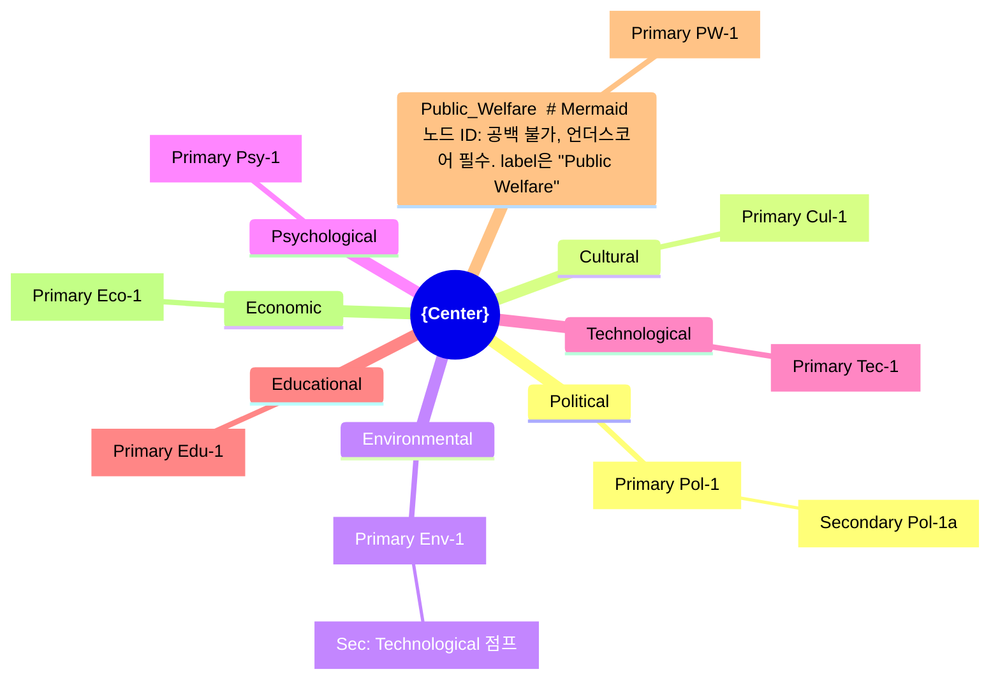

# Sub-skill: Domain V2


---

## 0. 결정론 환원 원칙

아래 연산은 **반드시 `domain_engine.py`를 호출해 수행**한다.

| 연산 | 방법 | 명령 |
|---|---|---|
| 입력 검증 (depth_target, cross_ratio) | domain_engine.py | `validate_input` |
| Domains Frame 검증·섹터 목록 확인 | domain_engine.py | `validate_frame` |
| 도메인 커버리지 검증 (각 domain ≥ min) | domain_engine.py | `check_domain_coverage` |
| Balance Audit (CV 분산, 편향 탐지) | domain_engine.py | `compute_balance_audit` |
| Cross/Intra 링키지 분류·비율 계산 | domain_engine.py | `classify_linkage` |
| Impact ID 생성 (결정론적 명명규칙) | domain_engine.py | `generate_impact_id` |
| V2 domain-bucketed 임팩트 생성 | LLM | |
| Domain specialist 서술 | LLM | |
| Cross-domain 통찰 합성 | LLM | |

```bash
echo '<JSON>' | python3 domain_engine.py <command>
```

Balance Audit CV 공식: `CV = std_dev / mean`. 임계값: low ≤0.30, medium 0.30~0.60, high >0.60.
Cross-domain 비율 공식: `cross_fraction = cross_count / (cross_count + intra_count)`. 목표: ≥0.5.

---
> **출처**: Glenn (2009) V3.0 06장 §VI "Frontiers of the Method" > "Version 2" + Figure 6 (African Economic Integration)
> **상위 마스터**: `vision-foresight-futures-wheel`
> **호출 권한**: 마스터 orchestration 전용 (disable-model-invocation: true)

## 1. PDF 원전 정의

Glenn(2009) 직접 인용:

> *"Glenn became dissatisfied that the original version of the Futures Wheel did not always create a sufficiently broad range of impacts for consideration; therefore, he developed a second version. This 'Version 2' has been used in training programs since the late 1970s, but far less so than the original version; however, it first appeared later in Futures Research Methodology Version 2.0 in 1993."*

> *"The original version of the Futures Wheel did not force users to consider a realistically wide range of consequences. For example, economists would naturally tend to identify economic implications but would possibly put less stress on the technological, cultural, or environmental consequences of the trend or event. Version 2 adds the requirement that impacts be considered for a predetermined set of areas or domains."*

> *"If one were to do a Version 2 Futures Wheel on the possible event of African economic integration, one would be asked to list the important areas of consequence or impact to consider. These could be the political, cultural, environmental, psychological, technological, educational, public welfare, and economic arenas. The specific sectors that are used would be determined by the purposes of the analysis but should be as broad as manageably possible."*

## 2. 본 sub-skill 핵심 목적: Analyst Bias 교정

Version 2의 *raison d'être*: 분석가의 직업·전문 편향이 한 도메인에 impact를 몰리게 하는 현상 방지. 강제 도메인 bucketing.

PDF 명시 예: 경제학자는 경제 영향에 쏠림 → 기술·문화·환경 영향 누락 → Version 2가 균형 강제

## 3. Domains Frame 옵션 (마스터에서 전달)

| # | Frame | 영역 수 | 출처 |
|---|-------|--------|------|
| 1 | **Glenn V2 8 sector** (default) | 8 | PDF Figure 6 |
| 2 | STEEPS | 6 | 박사님 미래학 프레임 |
| 3 | STEEP | 5 | Aguilar 1967 |
| 4 | PESTLE | 6 | 경영전략 |
| 5 | STEEPV | 6 | Coates |
| 6 | Voros 4 Layers | 4 | CLA 호환 |
| 7 | Bell 9 dimensions | 9 | Wendell Bell 1997 — ⚠ 9-dimension list는 학술 해석; 원전 verbatim 아님. 인용 시 주의. |
| 8 | Inayatullah 6 Pillars | 6 | Inayatullah | | 6 | Inayatullah |
| 9 | STEEP-AI | 6 | AI 강조 |
| 10 | Free-form (V1로 전환) | - | V1 적용 |
| 11 | Custom | 사용자 입력 | - |
| 12 | Skip (자동 추론) | - | 마스터가 추론 |

### 3.1 Glenn V2 8 Sector (default) 상세

```
1. Political      — 정부·국제관계·법·규제·지정학
2. Cultural       — 가치관·관습·언어·예술·세대·아이덴티티
3. Environmental  — 기후·생태·자원·도시·재난
4. Psychological  — 인지·정서·정신건강·집단심리
5. Technological  — 기술·플랫폼·인프라·과학
6. Educational    — 학교·평생학습·기술교육·문해력
7. Public Welfare — 사회복지·보건·안전·인권·사회망
8. Economic       — 산업·노동·자본·금융·통화·무역
```

PDF Figure 6 참조: 8개 도메인이 wheel 외곽 박스로 배치되어, 각 domain마다 primary→secondary 가지가 연결됨.

## 4. AI Agent 5인 구성

| Agent | 역할 | 추가 작업 |
|-------|------|---------|
| **Leader Agent** | basic-v1과 동일 + domain bucketing 진행 | 도메인 별 spoke 그룹 명시 |
| **Domain-Specialist Panel** | 각 domain마다 1~2인 specialist 캐스팅 (`foresight-expert-pool`) | 도메인 균형 강제 |
| **Critic Agent (Balance Audit)** | 도메인 별 impact count, diversity, cross-linkage 카운트 | 쏠림 발견 시 재발굴 요청 |
| **Synthesizer Agent** | domain cross-linkage 식별, balance score 산출 | - |
| **Visualizer Agent** | Figure 6 스타일 outer-box label wheel | 도메인 별 색상 차별화 |

## 5. 5 Phase 처리 흐름

### Phase 1 — Domains Frame Lock-in

마스터에서 전달받은 `domains_frame` payload 적용. 결측 시 V2 8 sector 자동 적용.

```yaml
domains_frame:
  name: "Glenn V2 8 sector"
  sectors:
    - Political
    - Cultural
    - Environmental
    - Psychological
    - Technological
    - Educational
    - Public Welfare
    - Economic
  min_impacts_per_sector: 1
  target_impacts_per_sector: 2~3
```

### Phase 2 — Center Definition

basic-v1과 동일. 마스터에서 4요소 전달받음.

### Phase 3 — Domain-bucketed Primary Ring

각 domain별 specialist agent가 primary impact 1~3개씩 발굴. Leader Agent가 도메인 label과 함께 oval 배치.

**산출 형식**:

| Domain | Primary # | Impact | 부호(🟢🔴🟡) | 시간 | Tier(R-1/R-2/H) |
|--------|-----------|--------|------------|------|----------------|
| Political | P-Pol-1 | {impact} | 🔴 | T+1~5y | R-2 |
| Political | P-Pol-2 | {impact} | 🟡 | T+1~5y | R-2 |
| Cultural | P-Cul-1 | {impact} | 🟢 | T+1~5y | R-2 |
| Environmental | P-Env-1 | {impact} | 🔴 | T+1~5y | R-1 |
| Psychological | P-Psy-1 | {impact} | 🟡 | T+1~5y | R-2 |
| Technological | P-Tec-1 | {impact} | 🟢 | T+1~5y | R-1 |
| Educational | P-Edu-1 | {impact} | 🟢 | T+1~5y | R-2 |
| Public Welfare | P-PW-1 | {impact} | 🔴 | T+1~5y | R-2 |
| Economic | P-Eco-1 | {impact} | 🟡 | T+1~5y | R-1 |

### Phase 4 — Domain-bucketed Secondary Ring

primary→secondary 분기. **핵심**: secondary가 어느 domain에 속하는지 명시. cross-domain 분기 환영.

```
P-Tec-1 (Technological) → S-Tec-1a (Technological): 같은 domain 심화
P-Tec-1 (Technological) → S-Soc-1b (Social): cross-domain 점프 ← V2 가치!
P-Tec-1 (Technological) → S-Psy-1c (Psychological): cross-domain 점프
```

### Phase 5 — Domain Balance Audit

Critic Agent 점검:

```yaml
balance_audit:
  total_primary_impacts: 18
  per_domain_count:
    Political: 2
    Cultural: 2
    Environmental: 3
    Psychological: 2
    Technological: 3
    Educational: 2
    Public Welfare: 2
    Economic: 2
  variance: low (good)
  
  cross_domain_linkage_count: 14
  intra_domain_linkage_count: 18
  cross_fraction: 0.44  # cross_count/(cross_count+intra_count) = 14/32. domain_engine.py classify_linkage
  
  bias_alerts:
    - "Technological domain has 3 impacts (max). 다른 domain 보강 권장: Cultural, Psychological"
  
  rebalance_actions:
    - Cultural domain에서 P-Cul-3 발굴 시도
    - Psychological domain의 P-Psy-1 secondary 추가 발굴
```

쏠림 감지 시 Domain-Specialist Panel에 재발굴 요청.

**결정론 검증 (domain_engine.py):**

```bash
echo '{"sectors":[...],"per_domain_count":{...}}' | python3 domain_engine.py check_domain_coverage
echo '{"sectors":[...],"per_domain_count":{...}}' | python3 domain_engine.py compute_balance_audit
echo '{"linkages":[...],"target_ratio":0.5}' | python3 domain_engine.py classify_linkage
```

## 6. 출력 표준 형식

### 6.1 Mermaid Domain-Labeled Mindmap



### 6.2 ASCII Domain Grid (Figure 6 재현)

```
       ┌──────────────┐   ┌──────────────┐
       │ 8. Economic  │   │ 1. Cultural  │
       └──────┬───────┘   └──────┬───────┘
              │                  │
              ▼                  ▼
       ┌──────────────────────────────┐
       │      Primary Impact          │
       │       Primary Impact         │
       │                              │
       │   ┌──────────────────┐       │
       │   │  {Center}        │       │
       │   └──────────────────┘       │
       │       Primary Impact         │
       │      Primary Impact          │
       └──────────────────────────────┘
              ▲                  ▲
              │                  │
       ┌──────┴───────┐   ┌──────┴───────┐
       │ 7. Env'l     │   │ 2. Psych     │
       └──────────────┘   └──────────────┘
```

(8개 outer box 모두 배치)

### 6.3 Cross-Domain Linkage Table

```markdown
| From Domain | Primary | → To Domain | Secondary | Linkage Type |
|-------------|---------|-------------|-----------|--------------|
| Technological | P-Tec-1 | Psychological | S-Psy-1a | cross |
| Economic | P-Eco-1 | Environmental | S-Env-1b | cross |
| Political | P-Pol-1 | Political | S-Pol-1a | intra |
| ... | ... | ... | ... | ... |
```

cross/intra 비율이 V2 분석 품질의 핵심 지표 — cross가 많을수록 *비선형 통찰* 강함.

## 7. PDF 인용 fragment

Glenn(2009)의 결정적 구절을 결과물에 항상 포함:

> *"The original version of the Futures Wheel did not force users to consider a realistically wide range of consequences. ... Version 2 adds the requirement that impacts be considered for a predetermined set of areas or domains."* (PDF V3.0 §VI)

## 8. 마스터 입력 인터페이스

```yaml
sub_skill: vision-foresight-futures-wheel-domain-v2
inputs:
  center_issue: { ... }
  domains_frame:
    name: "Glenn V2 8 sector"
    sectors: [...]
    min_impacts_per_sector: 1
    target_impacts_per_sector: 2~3
  depth_target: 6         # default 6 (박사님 강화). V2도 6차 기본. domain_engine.py validate_input 검증
  cross_domain_target_ratio: 0.5+   # cross/intra 목표
  expert_pool_cast: [{ ... }]
outputs:
  - mermaid_domain_mindmap
  - ascii_domain_grid
  - cross_linkage_table
  - balance_audit_report
  - pdf_citations
```

## 9. 호출 후 마스터로 반환

```yaml
sub_skill_output:
  status: completed
  domains_used: [...]
  per_domain_count: { Political: N, ... }
  cross_domain_linkage_count: N
  balance_audit:
    variance: low|medium|high
    bias_alerts: [...]
    rebalance_actions: [...]
  contradictions_detected: [...]
  visualizations: { ... }
  pdf_citations: [...]
```

마스터는 `quality-control` sub-skill로 escalate 가능 (variance high 또는 contradictions 발견 시).

## 10. references/

| 파일 | 용도 |
|------|------|
| `references/glenn_v2_8_sectors.md` | V2 8 sector 정의·하위 토픽 카탈로그 |
| `references/figure6_african_integration.md` | PDF Figure 6 재현 가이드 |
| `references/domain_balance_audit_protocol.md` | Critic Agent의 균형 점검 알고리즘 |
| `references/domains_frame_options.md` | 12개 frame 옵션 비교표 |
