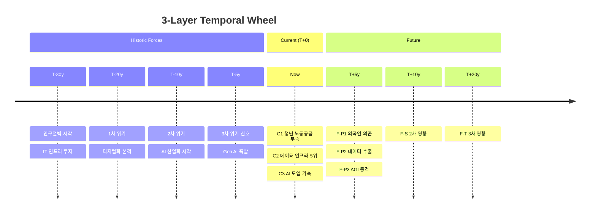

# Sub-skill: Temporal V3 (3D Cone)

> **출처**: Glenn (2009) V3.0 06장 §VI "Frontiers of the Method" > "Version 3" + Figure 7
> **상위 마스터**: `vision-foresight-futures-wheel`
> **호출 권한**: 마스터 orchestration 전용 (disable-model-invocation: true)

## 1. PDF 원전 정의

Glenn(2009) 직접 인용:

> *"A 'Version 3 Futures Wheel' would add the dimension of historic forces, current correlations, and future implications in a cone-like fashion. This approach has the advantage of providing a space for linkages or consequences that don't always fit in Versions 1 and 2. Some people want to discuss how a trend evolved, while others want to talk about more current impacts, and still others are more future-oriented. Version 3 is more complex, requiring more time, but can capture much of the essential thinking about a trend or event into one graphic."*

> *"A Version 3 Futures Wheel could be carried out by three different teams. One team could identify the key historical trends or events leading to the item to be studied; the second team the key contemporary impacts or correlations; and the third, the key future impacts or consequences. The results of the teams can be put into one Version 3 Futures Wheel."*

> *"Unfortunately, it may be difficult to graph if confined to a two-dimensional piece of paper. If done with computer software that allows for rotation (such as computer-assisted design software) and or in hypertext software (imbedding information under terms that are not seen until requested by the user), the Version 3 Futures Wheel becomes more visually manageable."*

## 2. Figure 7 — 3D Cone 구조

```
              ▲ Future Consequences
              │
              │
        ┌─────┴─────┐
        │  Future   │
        │   Cone    │   ← Future Team
        └─────┬─────┘
              │
        ┌─────┼─────┐
        │  Center   │   ← T+0
        │   Oval    │
        │ {Trend/   │
        │  Event}   │
        └─────┬─────┘
              │
        ┌─────┴─────┐
        │ Historic  │   ← Historic Team
        │   Cone    │
        └─────┬─────┘
              │
              ▼ Historic Forces
```

중간 horizontal ring에 Contemporary Team의 Current Impacts·Correlations 배치.

## 3. 3 Team 작업 분담

PDF 명시 3 team 그대로 적용:

| Team | 영역 | AI Agent Casting | 산출 |
|------|------|-----------------|------|
| **Historic Team** | 과거 driving force·event·trend·correlation | 역사학자·사회학자·경제사·기술사 specialist | T-50y ~ T-0 정리 |
| **Contemporary Team** | 현재 impact·correlation·existing state | 정책 분석·시장 분석·사회학·trend analyst | T+0 시점 horizontal ring |
| **Future Team** | 미래 implication primary·secondary·tertiary | 미래학자·시나리오 planner | T+0 ~ T+30y primary→secondary→tertiary |

각 team은 `foresight-expert-pool`에서 도메인·시간대 맞춰 3~5인 캐스팅.

## 4. AI Agent 6인 구성

| Agent | 역할 |
|-------|------|
| **Leader Agent** | 워크숍 진행, T+0 정의, team 작업 분배 |
| **Historic Team Panel** | 과거 driving force·trend·correlation 식별 |
| **Contemporary Team Panel** | 현재 시점 impact·correlation·existing state |
| **Future Team Panel** | 미래 primary·secondary·tertiary impact |
| **Synthesizer (Cross-Temporal)** | historic→current→future 인과 사슬, recurring pattern |
| **Visualizer (3D→2D)** | Figure 7 스타일 cone + 2D projection + hypertext fold |

## 5. 7 Phase 처리 흐름

### Phase 1 — Center Definition + Temporal Anchor

```yaml
center:
  what: "{이슈}"
  when (T+0): "{기준 시점}"
  where: "{지리적 범위}"
  who: "{주체}"
temporal_anchor:
  past_lookback: 50     # 기본 50y (허용 범위: 10~200y)
  future_lookahead: 30  # 기본 30y (허용 범위: 5~100y)
  T0_year: 2026         # 절대연도 기준점
```

```bash
# Temporal Anchor 결정론 검증 (LLM 재추론 금지)
python3 temporal_v3_engine.py validate_temporal_anchor \
  '{"past_lookback": 50, "future_lookahead": 30, "T0_year": 2026}'
# → {"historic_range": "1976~2026 (50년)", "future_range": "2026~2056 (30년)", "valid": true}

# T-30y 절대연도 계산 (결정론)
python3 temporal_v3_engine.py temporal_year '{"T0_year": 2026, "offset": -30}'
# → {"absolute_year": 1996, "offset_label": "T-30y"}
```

### Phase 2 — Historic Forces Team

Historic Team Panel이 과거 lookback 범위 내 driving force 식별. 시간 역순 정리:

```markdown
| Time | Historic Force/Event/Trend | 영향 방향 | 출처(R-1/R-2/H) |
|------|---------------------------|----------|---------------|
| T-30y | {force 1} | → Center | R-1 |
| T-20y | {force 2} | → Center | R-1 |
| T-15y | {trend 3 시작} | → Center | R-2 |
| T-10y | {policy 4} | → Center | R-1 |
| T-5y | {event 5} | → Center | R-1 |
| T-2y | {trigger 6} | → Center | R-1 |
```

**핵심**: 각 historic force가 *왜* 중앙 이슈로 이어졌는지 reasoning chain 명시.

### Phase 3 — Current Impacts/Correlations Team

Contemporary Team Panel이 T+0 시점 horizontal ring 구성:

```markdown
| ID | Current Impact/Correlation | Type | 강도(1-5) | Tier | 출처 |
|----|---------------------------|------|-----------|------|------|
| C1 | {impact} | direct_effect | 5 | R-1 | [citation] |
| C2 | {correlation} | correlation | 3 | R-2 | [citation] *(인과 불명)* |
| C3 | {existing state} | precondition | 4 | R-1 | [citation] |
```

**강도(1-5) 척도** (결정론 — LLM 임의 부여 금지):
```bash
python3 temporal_v3_engine.py intensity_scale '{"level": 5}'
# → {"label": "매우 강함", "description": "지배적 영향, 핵심 동인, 복수 독립 연구 확인"}
python3 temporal_v3_engine.py intensity_scale '{}'
# → 전체 척도 (1=매우약함 ~ 5=매우강함) 반환
```

| 강도 | 레이블 | 기준 |
|-----|------|------|
| 1 | 매우 약함 | 간접 관련, 전문가 의견 분분 |
| 2 | 약함 | 관련성 있으나 통계 유의성 낮음 |
| 3 | 중간 | 명확한 관련성, 대다수 전문가 인정 |
| 4 | 강함 | 강한 인과 연관, R-1 증거 존재 |
| 5 | 매우 강함 | 지배적 영향, 복수 독립 연구 확인 |

**유형(Type) 표준** (5종 — LLM 임의 표현 금지):
- `direct_effect`: 직접 인과적 결과
- `correlation`: 인과 불명 상관관계 *(Glenn §endnote4 준수: "correlate not cause")*
- `precondition`: 선결 조건
- `mediating_factor`: 매개 요인
- `contextual_factor`: 맥락 요인

```bash
# Current Impact 스키마 검증 (결정론)
python3 temporal_v3_engine.py validate_current_impact '{"impact": {
  "id": "C1", "text": "...", "type": "direct_effect", "intensity": 5, "tier": "R-1"
}}'
```

PDF §endnote 4 인용:
> *"Philosophically, one cannot claim certainty of causality. ... Originally, one would do a Futures Wheel by answering the question 'What are the necessary correlations (not in the mathematical sense) with the event or trend?'"*

본 phase는 correlation과 causation 명시적 구별 (결정론 유형 시스템으로 강제).

### Phase 4 — Future Consequences Team (박사님 2026-05-11 6차 강화)

Future Team Panel이 T+0~T+50y **6 ring** 식별 (basic-v1 9 Phase와 동일 6차 구조 + deep-reasoning-engine PRRG Gate 자동 호출):

```markdown
| 차수 | # | Future Consequence | T 시간 | Tier | Gate |
|-----|---|---------------------|-------|------|------|
| Primary | F-P1 | {impact} | T+1~5y | R-1·R-2 | P1_Pre 통과 |
| Secondary | F-S1a | {impact} | T+5~10y | R-2 | P2_Pre 통과 |
| Tertiary | F-T1a1 | {impact} | T+10~20y | R-2·R-3 | P3_Pre 통과 |
| **Quaternary** ⭐ | F-Q1a1a | {impact backlash} | T+15~25y | R-3 | P4_Pre 통과 + sign reversal |
| **Quinary** ⭐ | F-Qn1a1a1 | {paradigm shift} | T+20~30y | R-3·H | P5_Pre 통과 |
| **Senary** ⭐ | F-Sn1a1a1a | {civilizational} | T+25~50y | H | P6_Pre 통과 + attractor |
```

⚠️ **Senary ID 규칙**: `F-Sn1a1a1a` (Latin 'a'만 사용). Greek 문자 (알파·베타 등) 절대 금지.

**Future ID 결정론 생성** (LLM 직접 기입 금지):
```bash
python3 temporal_v3_engine.py generate_future_id '{"ring": 1, "lineage_path": "1"}'
# → {"node_id": "F-P1", "time_range": "T+1~5y"}

python3 temporal_v3_engine.py generate_future_id '{"ring": 6, "lineage_path": "1a1a1a"}'
# → {"node_id": "F-Sn1a1a1a", "time_range": "T+25~50y"}
```

**시간 범위 조회** (결정론):
```bash
python3 temporal_v3_engine.py ring_time_range '{"ring_num": 4, "T0_year": 2026}'
# → {"time_range": "T+15~25y", "absolute_range": "2041~2051",
#    "overlap_with_prev": "Ring 3(T+10~20y)와 시간 중첩 — 불확실성 cone 확대 표현 (의도적)"}
```

미래 cone은 6 ring이 시간축 상단으로 갈수록 spread 더 넓게 펼침 (uncertainty 증가).
**ring 4~6의 시간 중첩은 Glenn V3 cone 특성 — 불확실성 확대를 시각적으로 표현, 오류 아님.**

### Phase 5 — Cone Assembly

3 team 산출을 Figure 7 cone으로 통합. **완전성 결정론 검증 필수**:

```bash
python3 temporal_v3_engine.py validate_cone_assembly '{
  "historic_count": <N>,
  "current_count": <M>,
  "future_primary_count": <P>,
  "future_rings_count": {"Secondary": <S>, "Tertiary": <T>, ...}
}'
# → "valid": true, "three_team_complete": true 확인 후 진행

python3 temporal_v3_engine.py cone_summary '{
  "T0_year": 2026, "past_lookback": 50, "future_lookahead": 30,
  "historic_count": <N>, "current_count": <M>,
  "future_rings": {"Primary": <P>, "Secondary": <S>, ...}
}'
```

3 team 산출을 Figure 7 cone으로 통합:

```
                  T+20y ●        ● Tertiary F-T1a1
                       /│\      /│\
                  T+10y ●  ●  ●  ●  Secondary F-S1a,1b,2a,2b
                       /│\/│\/│\/│\
                   T+5y ● ● ● ● ●    Primary F-P1, P2, P3, P4, P5
                       \│/│\│/│\│/
              ━━━━━━━━━━━━●━━━━━━━━━━━━━ T+0  Center Oval
              ──── Current Ring ─────── C1·C2·C3·C4·C5
              ━━━━━━━━━━━━●━━━━━━━━━━━━━
                       /│\│/│\│/│\
                   T-5y ● ● ● ● ● ●   Historic recent
                       /│\/│\/│\/│\
                  T-10y ●  ●  ●  ●     Historic mid
                       /│\      /│\
                  T-20y ●        ●     Historic far
                       /│\
                  T-50y ●               Historic deep
```

### Phase 6 — Cross-Temporal Linkage

Synthesizer Agent가 historic→current→future 인과 사슬 추적.

**⚠️ chain type 표준**: Section 6의 5종 분류 사용. Phase 6 예시의 비표준 표현은 결정론 매핑 적용:

```bash
# "linear amplification" → "cycle" 자동 매핑
python3 temporal_v3_engine.py classify_pattern '{"pattern_type": "linear amplification"}'
# → {"standard_key": "cycle", "matched": true}

# chain 유효성 검증
python3 temporal_v3_engine.py validate_ct_chain '{"chain": {
  "chain_id": "CT-1", "historic": "...", "current": "...", "future": "...", "type": "cycle"
}}'
```

```yaml
cross_temporal_chains:
  - chain_id: CT-1
    historic: "T-20y 인구절벽 시작"
    current: "C2 청년 노동공급 부족 현재진행"
    future: "F-P3 외국인 노동력 의존도 증가 (T+5y)"
    type: "cycle"  # ← Section 6 표준 분류 (과거: "linear amplification"은 비표준)
    
  - chain_id: CT-2
    historic: "T-30y IT 인프라 투자"
    current: "C3 한국 데이터 인프라 글로벌 5위"
    future: "F-P1 AGI 학습 데이터 수출 (T+3y)"
    type: "compound_advantage"  # ← Section 6 표준
    
  - chain_id: CT-3 (recurring pattern)
    historic: "T-50y, T-30y, T-10y 경제 위기 주기"
    current: "C5 경기 둔화 신호"
    future: "F-P4 2027~2030 경제 위기 가능성"
    type: "cycle"  # ← "recurring 20y cycle"의 표준 분류
```

**5종 표준 type** (Section 6 기준 — LLM 임의 표현 금지):
`cycle` | `echo` | `compound_advantage` | `reversal` | `phase_transition`

**Recurring Pattern 발견**은 V3의 고유 가치 — V1·V2로는 보이지 않는다.

### Phase 7 — 2D Projection (hypertext fold)

PDF 명시 한계 인정 — 3D cone은 2D 종이에서 어렵다. 본 sub-skill은 다음 3가지 representation 동시 제공:

**A. Mermaid Timeline + Mindmap 결합**:



**B. ASCII 3-layer wheel** (간략):

```
[Future Cone]   F-T1··F-T2··F-T3  ← T+20y
                F-S1··F-S2··F-S3  ← T+10y
                F-P1··F-P2··F-P3  ← T+5y
─────────────── ● ───────────────  T+0 Center
[Current Ring]  C1··C2··C3
─────────────── ● ───────────────
[Historic Cone] H-5y······
                H-10y············
                H-20y··················
                H-30y··············
```

**C. Hypertext Fold (Markdown collapsible)**:

```markdown
<details>
<summary><b>▶ Historic Forces (click to expand)</b></summary>

| Time | Force | ... |
|------|-------|-----|
| T-30y | ... | ... |
| ... | ... | ... |
</details>

<details>
<summary><b>▶ Current Impacts (T+0)</b></summary>

...
</details>

<details>
<summary><b>▶ Future Consequences</b></summary>

...
</details>
```

## 6. Recurring Pattern Detector

Cross-Temporal Synthesizer가 다음 패턴 자동 탐지:

| 패턴 유형 | 식별 신호 | 미래 함의 |
|---------|---------|---------|
| **Cycle Pattern** | 일정 주기로 반복 (예: 20년 경제 위기) | 다음 cycle 시점 예측 |
| **Echo Pattern** | 과거 한 사건의 영향이 N년 후 reverberate | 현재 사건도 같은 echo 가능성 |
| **Compound Advantage** | 과거 투자→현재 dominance→미래 confirmed | leader position 유지 예상 |
| **Reversal Pattern** | 과거 trend가 임계점에서 역방향 전환 | 현재 trend 역전 가능성 |
| **Phase Transition** | 양적 누적이 질적 도약 | 다음 도약 시점 추정 |

## 7. PDF 인용 fragment

> *"Version 3 ... adds the dimension of historic forces, current correlations, and future implications in a cone-like fashion. ... This approach has the advantage of providing a space for linkages or consequences that don't always fit in Versions 1 and 2."* (PDF V3.0 §VI)

> *"A Version 3 Futures Wheel could be carried out by three different teams."* (PDF V3.0 §VI)

## 8. 마스터 입력 인터페이스

```yaml
sub_skill: vision-foresight-futures-wheel-temporal-v3
inputs:
  center_issue: { ... }
  temporal_anchor:
    past_lookback: 50
    future_lookahead: 30
    T0_year: 2026
  domains_frame: { ... }   # optional, 같이 적용 가능
  expert_pool_cast:
    historic_team: [...]
    contemporary_team: [...]
    future_team: [...]
  web_research_results:
    L1_current: {...}
    L2_glenn_v3: {...}
    L5_historical_analog: {...}
outputs:
  - cone_3d_representation
  - mermaid_timeline_mindmap
  - ascii_3layer_wheel
  - hypertext_fold
  - cross_temporal_chains
  - recurring_patterns
  - pdf_citations
```

## 9. 호출 후 마스터로 반환

```bash
# 반환 전 cone 완전성 최종 검증 (결정론)
python3 temporal_v3_engine.py validate_cone_assembly '{
  "historic_count": <N>, "current_count": <M>,
  "future_primary_count": <P>,
  "future_rings_count": {"Secondary": <S>, "Tertiary": <T>,
                         "Quaternary": <Q>, "Quinary": <Qn>, "Senary": <Sn>}
}'
# → "valid": true, "three_team_complete": true 확인 필수
```

```yaml
sub_skill_output:
  status: completed
  
  python_validation:
    cone_assembly_valid: true
    three_team_complete: true
  
  historic_forces_count: N    # ≥ 5 권장
  current_impacts_count: M    # ≥ 3 필수
  future_consequences:
    primary: P                # ≥ 3 필수
    secondary: S
    tertiary: T
    quaternary: Q             # 세옹지마 1차
    quinary: Qn               # 세옹지마 2차
    senary: Sn                # 세옹지마 3차
  
  cross_temporal_chains: [...]  # type: 5종 표준 중 하나
  recurring_patterns: [...]     # classify_pattern 결과
  scenario_branch_points: [...]
  visualizations:
    mermaid_timeline: "..."
    ascii_3layer: "..."
    hypertext_fold: "..."
  pdf_citations: [...]
```

마스터는 recurring pattern 발견 시 `scenario-forecast` sub-skill로 escalate.

## 10. references/ 및 Python 결정론 파일

### Python 결정론 파일 (할루시네이션 구조적 차단)

| 파일 | 위치 | 용도 |
|------|------|------|
| `temporal_v3_engine.py` | 본 스킬 폴더 | V3 전용 결정론 엔진 (14개 함수: 연도산술·ID생성·강도척도·패턴분류·cone검증 등) |

```bash
# 사용 가능한 모든 commands (LLM 추론 금지 구간):
python3 temporal_v3_engine.py -h
# temporal_year | validate_temporal_anchor | historic_time_in_range |
# future_time_in_range | ring_time_range | generate_future_id |
# parse_future_id | generate_historic_id | validate_current_impact |
# intensity_scale | classify_pattern | validate_ct_chain |
# validate_cone_assembly | cone_summary
```

### 참조 문서

| 파일 | 용도 |
|------|------|
| `references/glenn_v3_temporal_3d.md` | V3 cone 구조 상세 + Figure 7 재현 + 원전 직접 인용 |
| `references/three_team_protocol.md` | Historic·Contemporary·Future Team 운영 가이드 |
| `references/recurring_pattern_catalog.md` | 5종 recurring pattern 식별 알고리즘 + 학술 근거 |
| `references/hypertext_fold_template.md` | 2D projection 3종 완전 markdown 템플릿 |
