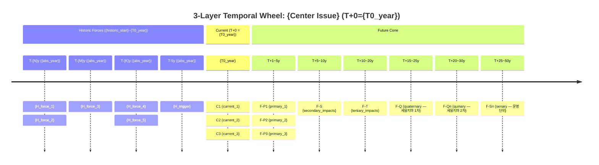

# Hypertext Fold Template — 2D Projection Markdown 템플릿

> 출처: Glenn (2009) §VI — "hypertext software (imbedding information under terms that are not seen until requested by the user)"
> 용도: Phase 7의 3종 2D representation 완전 양식

---

## Glenn 원전 근거

> *"If done with computer software that allows for rotation (such as computer-assisted design software) and or in hypertext software (imbedding information under terms that are not seen until requested by the user), the Version 3 Futures Wheel becomes more visually manageable."*
>
> — Glenn (2009), §VI, V3.0 Ch.06

본 템플릿은 Markdown collapsible 태그를 "hypertext software" 개념의 구현체로 사용.

---

## Representation A — Mermaid Timeline + Mindmap 결합



---

## Representation B — ASCII 3-Layer Wheel

```
[Future Cone]
  T+25~50y  F-Sn1····F-Sn2····  ← Senary (세옹지마 3차, 문명 단위)
  T+20~30y  F-Qn1···F-Qn2···    ← Quinary (세옹지마 2차)
  T+15~25y  F-Q1··F-Q2··F-Q3·   ← Quaternary (세옹지마 1차) ※ T-3과 중첩
  T+10~20y  F-T1··F-T2··F-T3··  ← Tertiary
  T+5~10y   F-S1a·F-S1b·F-S2a·  ← Secondary
  T+1~5y    F-P1··F-P2··F-P3··  ← Primary
──────────── ● ─────────────────── T+0 Center: {Center Issue}
[Current Ring] C1·C2·C3·C4·C5
──────────── ● ───────────────────
  T-5y      H-5y·H-5y·H-5y      ← Historic recent
  T-10y     H-10y···H-10y···    ← Historic mid
  T-20y     H-20y·········      ← Historic far
  T-30y     H-30y·····          ← Historic deep
  T-50y     H-50y               ← Historic deepest
[Historic Cone]
```

※ 주석: 중첩(T+15~25y와 T+10~20y)은 Glenn V3 cone 특성 — 불확실성 확대 표현.

---

## Representation C — Hypertext Fold (Markdown Collapsible)

```markdown
# V3 Temporal Wheel: {Center Issue}
**T+0**: {T0_year} | **Historic**: T-{past_lookback}y~T+0 | **Future**: T+0~T+{future_lookahead}y

---

<details>
<summary><b>▶ Historic Forces ({historic_start}~{T0_year}) — 클릭하여 펼치기</b></summary>

| Time | Absolute | Historic Force/Event/Trend | 영향 방향 | ID | Tier | 출처 |
|------|----------|---------------------------|----------|----|------|------|
| T-{N}y | {year} | {force_1} | → Center | H_T{N}_1 | R-1 | [citation] |
| T-{M}y | {year} | {force_2} | → Center | H_T{M}_1 | R-1 | [citation] |
| T-{K}y | {year} | {trend_3 시작} | → Center | H_T{K}_1 | R-2 | [citation] |
| T-10y | {year} | {policy_4} | → Center | H_T10_1 | R-1 | [citation] |
| T-5y | {year} | {event_5} | → Center | H_T5_1 | R-1 | [citation] |
| T-2y | {year} | {trigger_6} | → Center | H_T2_1 | R-1 | [citation] |

**Recurring Patterns 발견**:
- {pattern_type}: {description}
- ...

</details>

---

<details>
<summary><b>▶ Current Impacts (T+0 = {T0_year}) — 클릭하여 펼치기</b></summary>

| ID | Current Impact/Correlation | Type | 강도(1-5) | Tier | 출처 |
|----|---------------------------|------|-----------|------|------|
| C1 | {impact_1} | direct_effect | 5 | R-1 | [citation] |
| C2 | {correlation_1} | correlation | 3 | R-2 | [citation] *(인과 불명 — Glenn §endnote4)* |
| C3 | {precondition_1} | precondition | 4 | R-1 | [citation] |
| C4 | {impact_2} | mediating_factor | 3 | R-2 | [citation] |
| C5 | {context_1} | contextual_factor | 2 | R-3 | [citation] |

**강도 척도**: 1=매우 약함 ~ 5=매우 강함
*(결정론 확인: `temporal_v3_engine.py intensity_scale {"level": N}`)*

</details>

---

<details>
<summary><b>▶ Future Consequences (T+0~T+{future_lookahead}y) — 클릭하여 펼치기</b></summary>

#### Primary Ring (T+1~5y)

| ID | Consequence | Sign | Tier | Gate | 출처 |
|----|------------|------|------|------|------|
| F-P1 | {primary_1} | 🟢 | R-1·R-2 | P1_Pre ✓ | [citation] |
| F-P2 | {primary_2} | 🔴 | R-1·R-2 | P1_Pre ✓ | [citation] |
| F-P3 | {primary_3} | 🟡 | R-2 | P1_Pre ✓ | [citation] |

#### Secondary Ring (T+5~10y)

| ID | Consequence | Sign | Tier | 출처 |
|----|------------|------|------|------|
| F-S1a | {secondary_1a from F-P1} | 🔴 | R-2 | [citation] |
| F-S1b | {secondary_1b from F-P1} | 🟢 | R-2 | [citation] |
| F-S2a | {secondary_2a from F-P2} | 🔴 | R-2 | [citation] |
| ... | ... | ... | ... | ... |

#### Tertiary Ring (T+10~20y)

... (각 Secondary에서 1~2 Tertiary)

#### ⭐ Quaternary Ring (T+15~25y — 세옹지마 1차 반전)

... (Tertiary와 T+15~20y 시간 중첩 — 의도적)

#### ⭐ Quinary Ring (T+20~30y — 세옹지마 2차 반전)

...

#### ⭐ Senary Ring (T+25~50y — 세옹지마 3차 반전·문명 단위)

⚠️ ID 형식: F-Sn1a1a1a (Latin 'a') — 'α'(Greek) 사용 금지

...

</details>

---

<details>
<summary><b>▶ Cross-Temporal Linkage — 인과 사슬 & Recurring Patterns</b></summary>

### Cross-Temporal Chains

| Chain ID | Historic | Current | Future | Type | Pattern |
|---------|---------|---------|--------|------|---------|
| CT-1 | {H_force} | {C_impact} | {F_consequence} | cycle | ... |
| CT-2 | {H_force} | {C_impact} | {F_consequence} | compound_advantage | ... |

*(결정론 분류: `temporal_v3_engine.py classify_pattern {"pattern_type": "..."}` )*

### Recurring Pattern 요약

| 패턴 | 유형 | 탐지 근거 | 미래 함의 |
|------|------|---------|---------|
| {pattern_1} | Cycle | {evidence} | {implication} |
| {pattern_2} | Reversal | {evidence} | {implication} |

</details>
```

---

## 완성도 검증 체크리스트

```
Phase 7 완료 전 확인:
□ Representation A (Mermaid timeline): Historic·Current·Future 3 section 모두 작성
□ Representation B (ASCII 3-layer): Center Oval 기준 상하 cone 대칭 구조
□ Representation C (Hypertext fold): 4개 <details> 블록 모두 완성
□ 모든 절대연도: temporal_v3_engine.py temporal_year로 확인 (LLM 재추론 금지)
□ 모든 Future ID: generate_future_id로 생성 (Greek α 금지)
□ 모든 Historic ID: generate_historic_id로 생성
□ cross-temporal chains: validate_ct_chain으로 유효성 확인
□ cone_summary로 3-team 완전성 최종 확인
```
